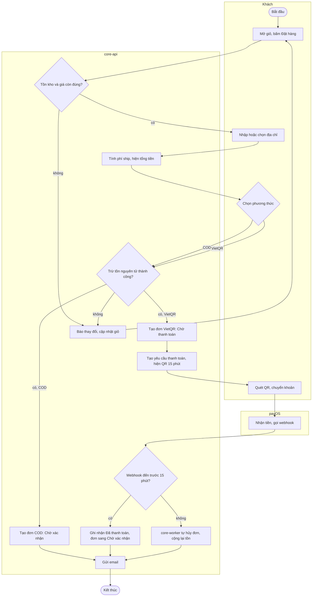

Nguồn: 01-UC.md > Mirra — B1: Phân rã và đặc tả use case > 5. Activity diagram > 5.1 Đặt hàng và thanh toán (UC07, UC08, UC29)
### 5.1 Đặt hàng và thanh toán (UC07, UC08, UC29)

```mermaid
flowchart TD
  subgraph KH[Khách]
    A1([Bắt đầu]) --> A2[Mở giỏ, bấm Đặt hàng]
    A3[Nhập hoặc chọn địa chỉ]
    A4{Chọn phương thức}
    A5[Quét QR, chuyển khoản]
  end
  subgraph CORE[core-api]
    B1{Tồn kho và giá còn đúng?}
    B2[Tính phí ship, hiện tổng tiền]
    B3{Trừ tồn nguyên tử thành công?}
    B4[Tạo đơn COD: Chờ xác nhận]
    B5[Tạo đơn VietQR: Chờ thanh toán]
    B6[Tạo yêu cầu thanh toán, hiện QR 15 phút]
    B7{Webhook đến trước 15 phút?}
    B8[Ghi nhận Đã thanh toán, đơn sang Chờ xác nhận]
    B9[core-worker tự hủy đơn, cộng lại tồn]
    B10[Gửi email]
    B11[Báo thay đổi, cập nhật giỏ]
  end
  subgraph PAY[payOS]
    C1[Nhận tiền, gọi webhook]
  end
  A2 --> B1
  B1 -- không --> B11 --> A2
  B1 -- có --> A3 --> B2 --> A4
  A4 -- COD --> B3
  A4 -- VietQR --> B3
  B3 -- không --> B11
  B3 -- có, COD --> B4 --> B10
  B3 -- có, VietQR --> B5 --> B6 --> A5 --> C1 --> B7
  B7 -- có --> B8 --> B10
  B7 -- không --> B9 --> B10
  B10 --> E([Kết thúc])
```

