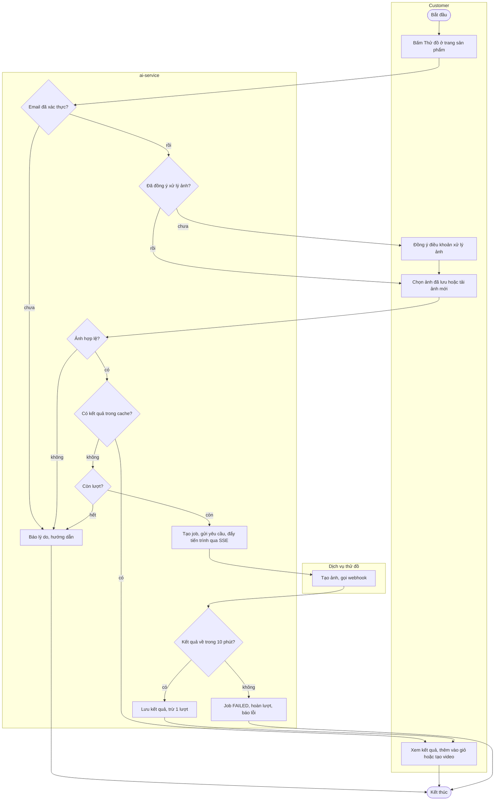

Nguồn: 01-UC.md > Mirra — B1: Phân rã và đặc tả use case > 5. Activity diagram > 5.2 Thử đồ bằng ảnh (UC12)
### 5.2 Thử đồ bằng ảnh (UC12)

```mermaid
flowchart TD
  subgraph KH[Customer]
    A1([Bắt đầu]) --> A2[Bấm Thử đồ ở trang sản phẩm]
    A3[Đồng ý điều khoản xử lý ảnh]
    A4[Chọn ảnh đã lưu hoặc tải ảnh mới]
    A5[Xem kết quả, thêm vào giỏ hoặc tạo video]
  end
  subgraph AI[ai-service]
    B1{Email đã xác thực?}
    B2{Đã đồng ý xử lý ảnh?}
    B3{Ảnh hợp lệ?}
    B4{Có kết quả trong cache?}
    B5{Còn lượt?}
    B6[Tạo job, gửi yêu cầu, đẩy tiến trình qua SSE]
    B7{Kết quả về trong 10 phút?}
    B8[Lưu kết quả, trừ 1 lượt]
    B9[Job FAILED, hoàn lượt, báo lỗi]
    B10[Báo lý do, hướng dẫn]
  end
  subgraph TP[Dịch vụ thử đồ]
    C1[Tạo ảnh, gọi webhook]
  end
  A2 --> B1
  B1 -- chưa --> B10
  B1 -- rồi --> B2
  B2 -- chưa --> A3 --> A4
  B2 -- rồi --> A4
  A4 --> B3
  B3 -- không --> B10 --> E([Kết thúc])
  B3 -- có --> B4
  B4 -- có --> A5
  B4 -- không --> B5
  B5 -- hết --> B10
  B5 -- còn --> B6 --> C1 --> B7
  B7 -- có --> B8 --> A5 --> E
  B7 -- không --> B9 --> E
```

