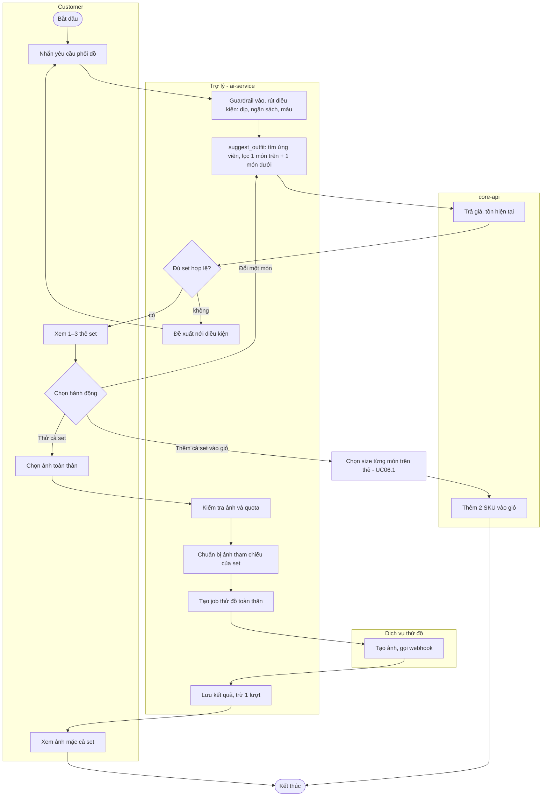

Nguồn: 01-UC.md > Mirra — B1: Phân rã và đặc tả use case > 5. Activity diagram > 5.3 Phối đồ và thử set (UC31, UC32)
### 5.3 Phối đồ và thử set (UC31, UC32)

```mermaid
flowchart TD
  subgraph KH[Customer]
    A1([Bắt đầu]) --> A2[Nhắn yêu cầu phối đồ]
    A3[Xem 1–3 thẻ set]
    A4{Chọn hành động}
    A5[Chọn ảnh toàn thân]
    A6[Xem ảnh mặc cả set]
  end
  subgraph AG[Trợ lý - ai-service]
    B1[Guardrail vào, rút điều kiện: dịp, ngân sách, màu]
    B2[suggest_outfit: tìm ứng viên, lọc 1 món trên + 1 món dưới]
    B3{Đủ set hợp lệ?}
    B4[Đề xuất nới điều kiện]
    B5[Kiểm tra ảnh và quota]
    B6[Chuẩn bị ảnh tham chiếu của set]
    B7[Tạo job thử đồ toàn thân]
    B8[Lưu kết quả, trừ 1 lượt]
  end
  subgraph CORE[core-api]
    C1[Trả giá, tồn hiện tại]
    C2[Thêm 2 SKU vào giỏ]
  end
  subgraph TP[Dịch vụ thử đồ]
    D1[Tạo ảnh, gọi webhook]
  end
  A2 --> B1 --> B2 --> C1 --> B3
  B3 -- không --> B4 --> A2
  B3 -- có --> A3 --> A4
  A4 -- Đổi một món --> B2
  A4 -- Thêm cả set vào giỏ --> X[Chọn size từng món trên thẻ - UC06.1] --> C2 --> E([Kết thúc])
  A4 -- Thử cả set --> A5 --> B5 --> B6 --> B7 --> D1 --> B8 --> A6 --> E
```

