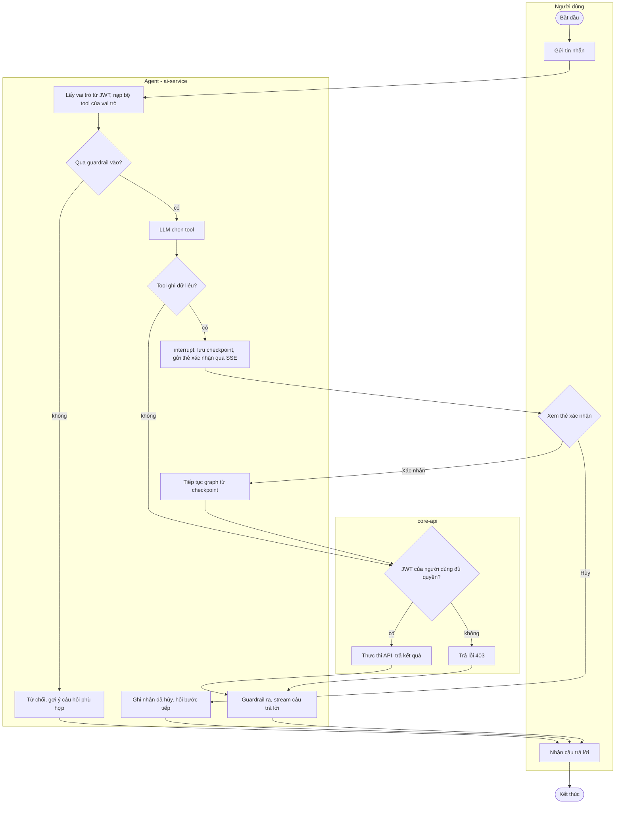

Nguồn: 01-UC.md > Mirra — B1: Phân rã và đặc tả use case > 5. Activity diagram > 5.4 Trợ lý xác nhận thao tác ghi (UC15, UC16)
### 5.4 Trợ lý xác nhận thao tác ghi (UC15, UC16)

```mermaid
flowchart TD
  subgraph ND[Người dùng]
    A1([Bắt đầu]) --> A2[Gửi tin nhắn]
    A3{Xem thẻ xác nhận}
    A4[Nhận câu trả lời]
  end
  subgraph AG[Agent - ai-service]
    B1[Lấy vai trò từ JWT, nạp bộ tool của vai trò]
    B2{Qua guardrail vào?}
    B3[LLM chọn tool]
    B4{Tool ghi dữ liệu?}
    B5[interrupt: lưu checkpoint, gửi thẻ xác nhận qua SSE]
    B6[Tiếp tục graph từ checkpoint]
    B7[Guardrail ra, stream câu trả lời]
    B8[Từ chối, gợi ý câu hỏi phù hợp]
    B9[Ghi nhận đã hủy, hỏi bước tiếp]
  end
  subgraph CORE[core-api]
    C1{JWT của người dùng đủ quyền?}
    C2[Thực thi API, trả kết quả]
    C3[Trả lỗi 403]
  end
  A2 --> B1 --> B2
  B2 -- không --> B8 --> A4
  B2 -- có --> B3 --> B4
  B4 -- không --> C1
  B4 -- có --> B5 --> A3
  A3 -- Hủy --> B9 --> A4
  A3 -- Xác nhận --> B6 --> C1
  C1 -- có --> C2 --> B7
  C1 -- không --> C3 --> B7
  B7 --> A4 --> E([Kết thúc])
```

