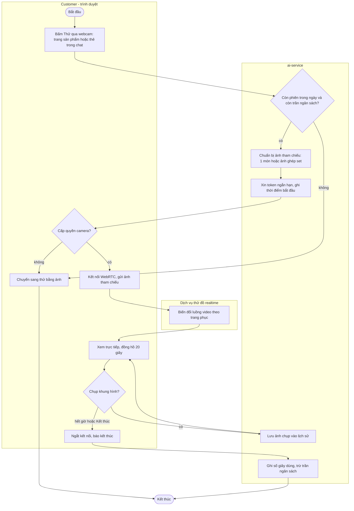

Nguồn: 01-UC.md > Mirra — B1: Phân rã và đặc tả use case > 5. Activity diagram > 5.5 Thử đồ qua webcam (UC33)
### 5.5 Thử đồ qua webcam (UC33)

```mermaid
flowchart TD
  subgraph KH[Customer - trình duyệt]
    A1([Bắt đầu]) --> A2[Bấm Thử qua webcam: trang sản phẩm hoặc thẻ trong chat]
    A3{Cấp quyền camera?}
    A4[Kết nối WebRTC, gửi ảnh tham chiếu]
    A5[Xem trực tiếp, đồng hồ 20 giây]
    A6{Chụp khung hình?}
    A7[Ngắt kết nối, báo kết thúc]
    A8[Chuyển sang thử bằng ảnh]
  end
  subgraph AI[ai-service]
    B1{Còn phiên trong ngày và còn trần ngân sách?}
    B2[Chuẩn bị ảnh tham chiếu: 1 món hoặc ảnh ghép set]
    B3[Xin token ngắn hạn, ghi thời điểm bắt đầu]
    B4[Lưu ảnh chụp vào lịch sử]
    B5[Ghi số giây dùng, trừ trần ngân sách]
  end
  subgraph RT[Dịch vụ thử đồ realtime]
    C1[Biến đổi luồng video theo trang phục]
  end
  A2 --> B1
  B1 -- không --> A8 --> E([Kết thúc])
  B1 -- có --> B2 --> B3 --> A3
  A3 -- không --> A8
  A3 -- có --> A4 --> C1 --> A5 --> A6
  A6 -- có --> B4 --> A5
  A6 -- hết giờ hoặc Kết thúc --> A7 --> B5 --> E
```

