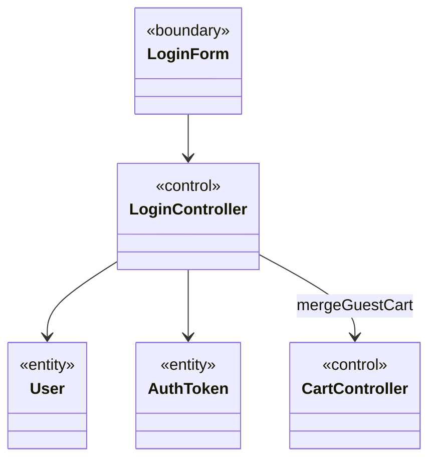
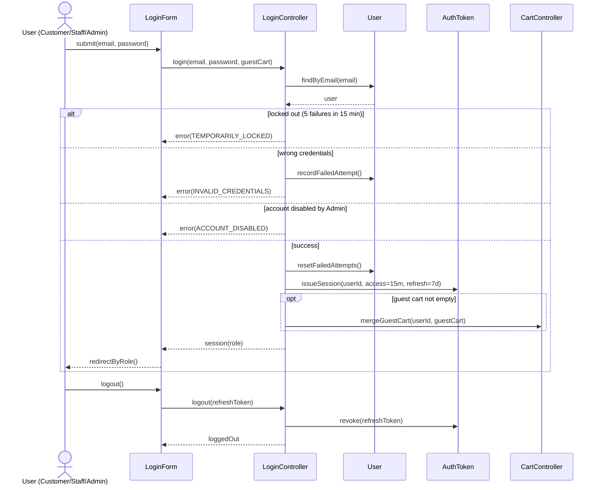

Nguồn: 02-BCE-AND-SEQUENCE.md > Mirra — B2: Phân tích BCE và sequence > 2. Nhóm Tài khoản > UC02 – Log in, log out
### UC02 – Log in, log out

```mermaid
classDiagram
  class LoginForm { <<boundary>> }
  class LoginController { <<control>> }
  class CartController { <<control>> }
  class User { <<entity>> }
  class AuthToken { <<entity>> }
  LoginForm --> LoginController
  LoginController --> User
  LoginController --> AuthToken
  LoginController --> CartController : mergeGuestCart
```

```mermaid
sequenceDiagram
  actor A as User (Customer/Staff/Admin)
  participant F as LoginForm
  participant C as LoginController
  participant U as User
  participant T as AuthToken
  participant K as CartController
  A->>F: submit(email, password)
  F->>C: login(email, password, guestCart)
  C->>U: findByEmail(email)
  U-->>C: user
  alt locked out (5 failures in 15 min)
    C-->>F: error(TEMPORARILY_LOCKED)
  else wrong credentials
    C->>U: recordFailedAttempt()
    C-->>F: error(INVALID_CREDENTIALS)
  else account disabled by Admin
    C-->>F: error(ACCOUNT_DISABLED)
  else success
    C->>U: resetFailedAttempts()
    C->>T: issueSession(userId, access=15m, refresh=7d)
    opt guest cart not empty
      C->>K: mergeGuestCart(userId, guestCart)
    end
    C-->>F: session(role)
    F-->>A: redirectByRole()
  end
  A->>F: logout()
  F->>C: logout(refreshToken)
  C->>T: revoke(refreshToken)
  C-->>F: loggedOut
```

