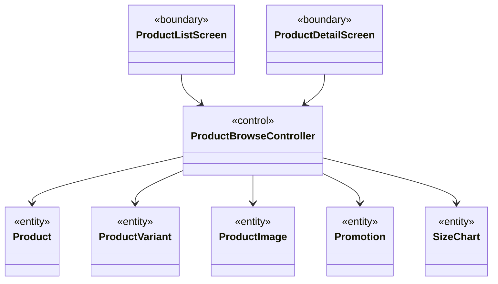
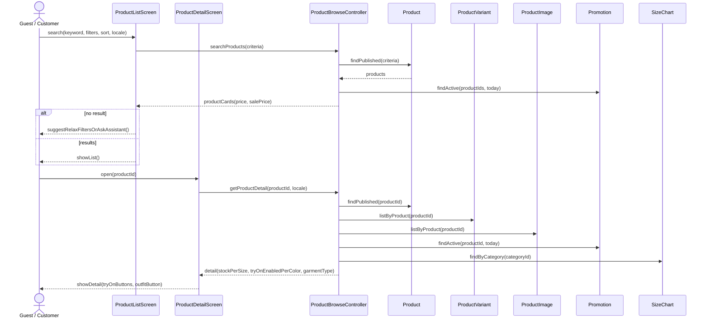

Nguồn: 02-BCE-AND-SEQUENCE.md > Mirra — B2: Phân tích BCE và sequence > 3. Nhóm Mua hàng > UC05 – Browse and search products (UC05.1–UC05.2)
### UC05 – Browse and search products (UC05.1–UC05.2)

```mermaid
classDiagram
  class ProductListScreen { <<boundary>> }
  class ProductDetailScreen { <<boundary>> }
  class ProductBrowseController { <<control>> }
  class Product { <<entity>> }
  class ProductVariant { <<entity>> }
  class ProductImage { <<entity>> }
  class Promotion { <<entity>> }
  class SizeChart { <<entity>> }
  ProductListScreen --> ProductBrowseController
  ProductDetailScreen --> ProductBrowseController
  ProductBrowseController --> Product
  ProductBrowseController --> ProductVariant
  ProductBrowseController --> ProductImage
  ProductBrowseController --> Promotion
  ProductBrowseController --> SizeChart
```

```mermaid
sequenceDiagram
  actor G as Guest / Customer
  participant L as ProductListScreen
  participant D as ProductDetailScreen
  participant C as ProductBrowseController
  participant P as Product
  participant V as ProductVariant
  participant I as ProductImage
  participant PR as Promotion
  participant S as SizeChart
  G->>L: search(keyword, filters, sort, locale)
  L->>C: searchProducts(criteria)
  C->>P: findPublished(criteria)
  P-->>C: products
  C->>PR: findActive(productIds, today)
  C-->>L: productCards(price, salePrice)
  alt no result
    L-->>G: suggestRelaxFiltersOrAskAssistant()
  else results
    L-->>G: showList()
  end
  G->>D: open(productId)
  D->>C: getProductDetail(productId, locale)
  C->>P: findPublished(productId)
  C->>V: listByProduct(productId)
  C->>I: listByProduct(productId)
  C->>PR: findActive(productId, today)
  C->>S: findByCategory(categoryId)
  C-->>D: detail(stockPerSize, tryOnEnabledPerColor, garmentType)
  D-->>G: showDetail(tryOnButtons, outfitButton)
```

