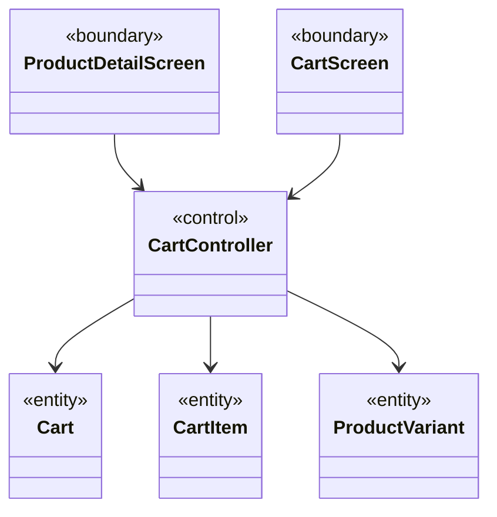
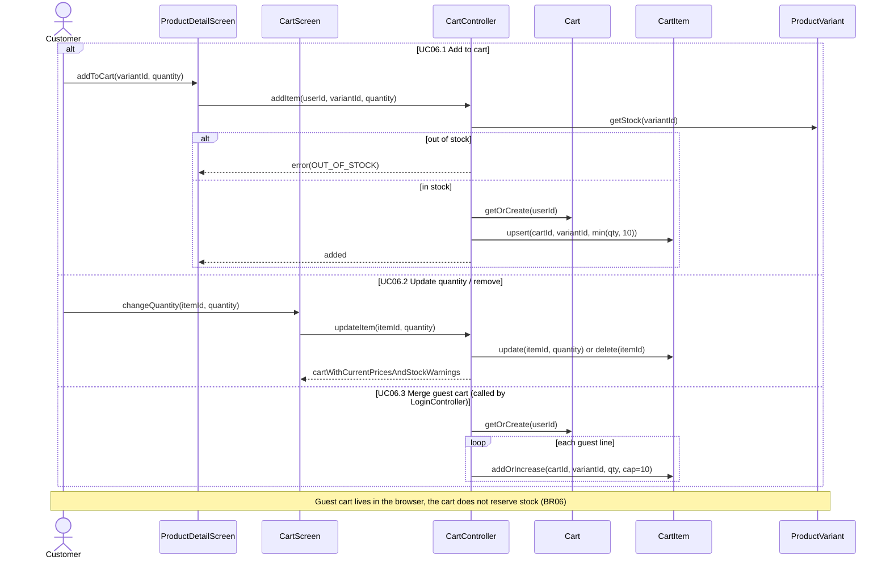

Nguồn: 02-BCE-AND-SEQUENCE.md > Mirra — B2: Phân tích BCE và sequence > 3. Nhóm Mua hàng > UC06 – Manage cart (UC06.1–UC06.3)
### UC06 – Manage cart (UC06.1–UC06.3)

```mermaid
classDiagram
  class CartScreen { <<boundary>> }
  class ProductDetailScreen { <<boundary>> }
  class CartController { <<control>> }
  class Cart { <<entity>> }
  class CartItem { <<entity>> }
  class ProductVariant { <<entity>> }
  ProductDetailScreen --> CartController
  CartScreen --> CartController
  CartController --> Cart
  CartController --> CartItem
  CartController --> ProductVariant
```

```mermaid
sequenceDiagram
  actor CU as Customer
  participant D as ProductDetailScreen
  participant S as CartScreen
  participant C as CartController
  participant CA as Cart
  participant I as CartItem
  participant V as ProductVariant
  alt UC06.1 Add to cart
    CU->>D: addToCart(variantId, quantity)
    D->>C: addItem(userId, variantId, quantity)
    C->>V: getStock(variantId)
    alt out of stock
      C-->>D: error(OUT_OF_STOCK)
    else in stock
      C->>CA: getOrCreate(userId)
      C->>I: upsert(cartId, variantId, min(qty, 10))
      C-->>D: added
    end
  else UC06.2 Update quantity / remove
    CU->>S: changeQuantity(itemId, quantity)
    S->>C: updateItem(itemId, quantity)
    C->>I: update(itemId, quantity) or delete(itemId)
    C-->>S: cartWithCurrentPricesAndStockWarnings
  else UC06.3 Merge guest cart (called by LoginController)
    C->>CA: getOrCreate(userId)
    loop each guest line
      C->>I: addOrIncrease(cartId, variantId, qty, cap=10)
    end
  end
  Note over CU,V: Guest cart lives in the browser, the cart does not reserve stock (BR06)
```

