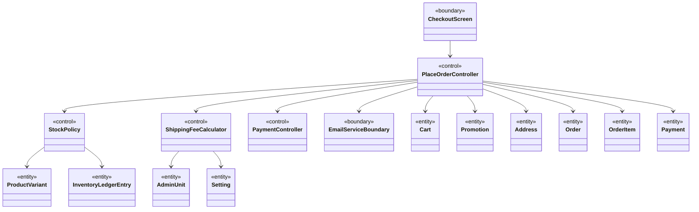
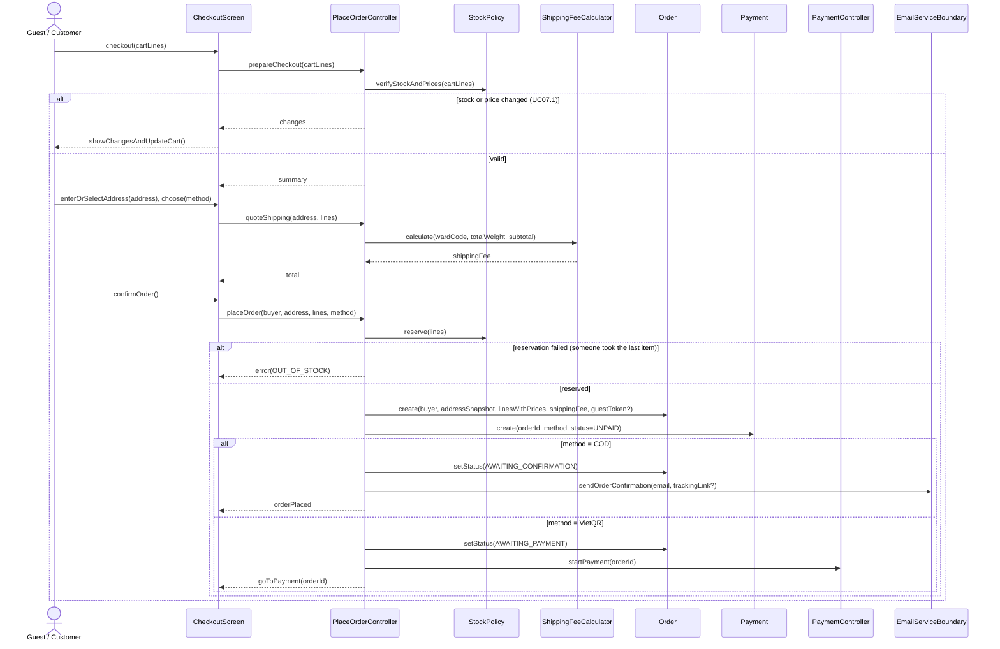

Nguồn: 02-BCE-AND-SEQUENCE.md > Mirra — B2: Phân tích BCE và sequence > 3. Nhóm Mua hàng > UC07 – Place order (gồm UC07.1–UC07.3)
### UC07 – Place order (gồm UC07.1–UC07.3)

```mermaid
classDiagram
  class CheckoutScreen { <<boundary>> }
  class PlaceOrderController { <<control>> }
  class StockPolicy { <<control>> }
  class ShippingFeeCalculator { <<control>> }
  class PaymentController { <<control>> }
  class EmailServiceBoundary { <<boundary>> }
  class Cart { <<entity>> }
  class ProductVariant { <<entity>> }
  class Promotion { <<entity>> }
  class Address { <<entity>> }
  class AdminUnit { <<entity>> }
  class Setting { <<entity>> }
  class Order { <<entity>> }
  class OrderItem { <<entity>> }
  class Payment { <<entity>> }
  class InventoryLedgerEntry { <<entity>> }
  CheckoutScreen --> PlaceOrderController
  PlaceOrderController --> StockPolicy
  PlaceOrderController --> ShippingFeeCalculator
  PlaceOrderController --> PaymentController
  PlaceOrderController --> EmailServiceBoundary
  PlaceOrderController --> Cart
  PlaceOrderController --> Promotion
  PlaceOrderController --> Address
  PlaceOrderController --> Order
  PlaceOrderController --> OrderItem
  PlaceOrderController --> Payment
  StockPolicy --> ProductVariant
  StockPolicy --> InventoryLedgerEntry
  ShippingFeeCalculator --> AdminUnit
  ShippingFeeCalculator --> Setting
```

```mermaid
sequenceDiagram
  actor G as Guest / Customer
  participant S as CheckoutScreen
  participant C as PlaceOrderController
  participant SP as StockPolicy
  participant SF as ShippingFeeCalculator
  participant O as Order
  participant PM as Payment
  participant PC as PaymentController
  participant E as EmailServiceBoundary
  G->>S: checkout(cartLines)
  S->>C: prepareCheckout(cartLines)
  C->>SP: verifyStockAndPrices(cartLines)
  alt stock or price changed (UC07.1)
    C-->>S: changes
    S-->>G: showChangesAndUpdateCart()
  else valid
    C-->>S: summary
    G->>S: enterOrSelectAddress(address), choose(method)
    S->>C: quoteShipping(address, lines)
    C->>SF: calculate(wardCode, totalWeight, subtotal)
    SF-->>C: shippingFee
    C-->>S: total
    G->>S: confirmOrder()
    S->>C: placeOrder(buyer, address, lines, method)
    C->>SP: reserve(lines)
    alt reservation failed (someone took the last item)
      C-->>S: error(OUT_OF_STOCK)
    else reserved
      C->>O: create(buyer, addressSnapshot, linesWithPrices, shippingFee, guestToken?)
      C->>PM: create(orderId, method, status=UNPAID)
      alt method = COD
        C->>O: setStatus(AWAITING_CONFIRMATION)
        C->>E: sendOrderConfirmation(email, trackingLink?)
        C-->>S: orderPlaced
      else method = VietQR
        C->>O: setStatus(AWAITING_PAYMENT)
        C->>PC: startPayment(orderId)
        C-->>S: goToPayment(orderId)
      end
    end
  end
```

