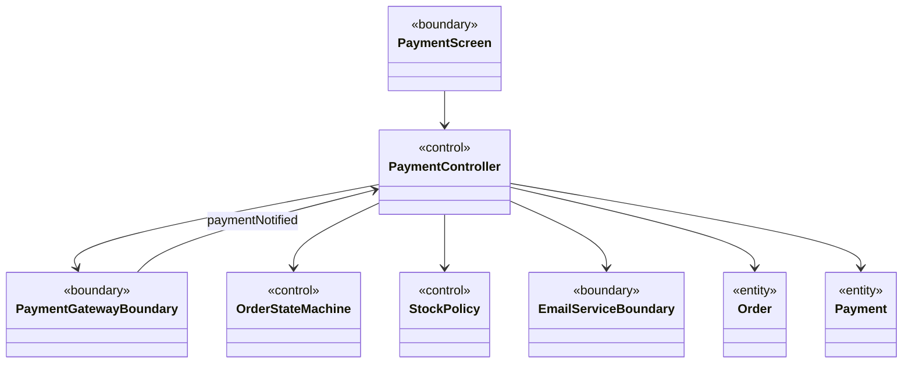
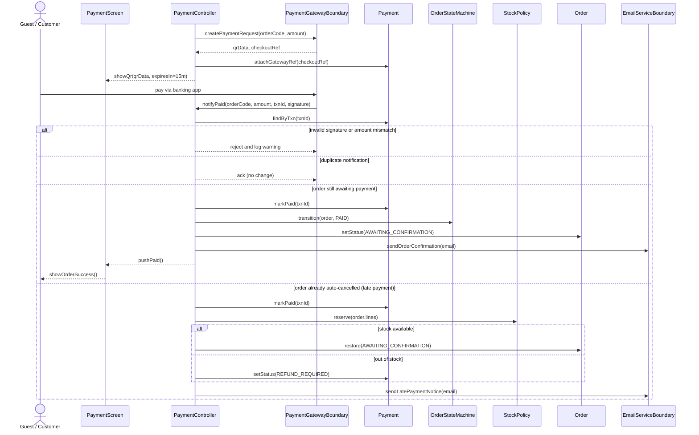

Nguồn: 02-BCE-AND-SEQUENCE.md > Mirra — B2: Phân tích BCE và sequence > 3. Nhóm Mua hàng > UC08 – Pay by VietQR
### UC08 – Pay by VietQR

```mermaid
classDiagram
  class PaymentScreen { <<boundary>> }
  class PaymentGatewayBoundary { <<boundary>> }
  class PaymentController { <<control>> }
  class OrderStateMachine { <<control>> }
  class StockPolicy { <<control>> }
  class EmailServiceBoundary { <<boundary>> }
  class Order { <<entity>> }
  class Payment { <<entity>> }
  PaymentScreen --> PaymentController
  PaymentGatewayBoundary --> PaymentController : paymentNotified
  PaymentController --> PaymentGatewayBoundary
  PaymentController --> OrderStateMachine
  PaymentController --> StockPolicy
  PaymentController --> EmailServiceBoundary
  PaymentController --> Order
  PaymentController --> Payment
```

```mermaid
sequenceDiagram
  actor G as Guest / Customer
  participant S as PaymentScreen
  participant C as PaymentController
  participant GW as PaymentGatewayBoundary
  participant PM as Payment
  participant SM as OrderStateMachine
  participant SP as StockPolicy
  participant O as Order
  participant E as EmailServiceBoundary
  C->>GW: createPaymentRequest(orderCode, amount)
  GW-->>C: qrData, checkoutRef
  C->>PM: attachGatewayRef(checkoutRef)
  C-->>S: showQr(qrData, expiresIn=15m)
  G->>GW: pay via banking app
  GW->>C: notifyPaid(orderCode, amount, txnId, signature)
  C->>PM: findByTxn(txnId)
  alt invalid signature or amount mismatch
    C-->>GW: reject and log warning
  else duplicate notification
    C-->>GW: ack (no change)
  else order still awaiting payment
    C->>PM: markPaid(txnId)
    C->>SM: transition(order, PAID)
    C->>O: setStatus(AWAITING_CONFIRMATION)
    C->>E: sendOrderConfirmation(email)
    C-->>S: pushPaid()
    S-->>G: showOrderSuccess()
  else order already auto-cancelled (late payment)
    C->>PM: markPaid(txnId)
    C->>SP: reserve(order.lines)
    alt stock available
      C->>O: restore(AWAITING_CONFIRMATION)
    else out of stock
      C->>PM: setStatus(REFUND_REQUIRED)
    end
    C->>E: sendLatePaymentNotice(email)
  end
```

