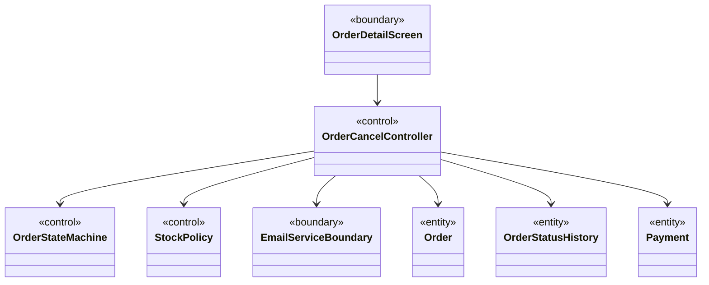
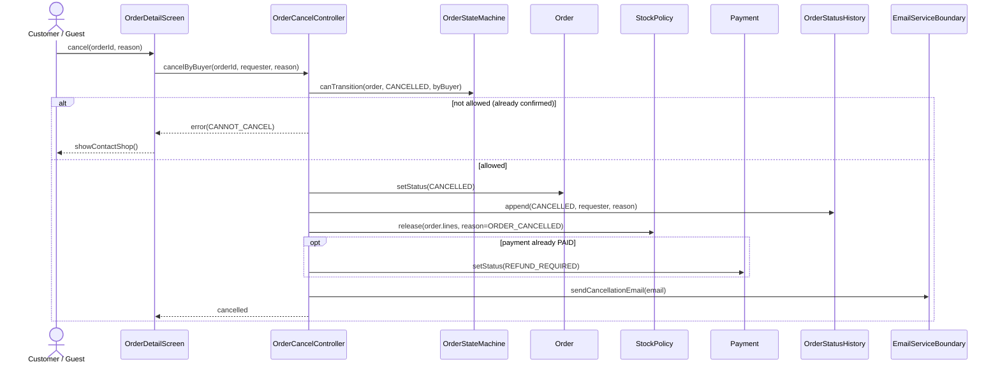

Nguồn: 02-BCE-AND-SEQUENCE.md > Mirra — B2: Phân tích BCE và sequence > 3. Nhóm Mua hàng > UC10 – Cancel order
### UC10 – Cancel order

```mermaid
classDiagram
  class OrderDetailScreen { <<boundary>> }
  class OrderCancelController { <<control>> }
  class OrderStateMachine { <<control>> }
  class StockPolicy { <<control>> }
  class EmailServiceBoundary { <<boundary>> }
  class Order { <<entity>> }
  class OrderStatusHistory { <<entity>> }
  class Payment { <<entity>> }
  OrderDetailScreen --> OrderCancelController
  OrderCancelController --> OrderStateMachine
  OrderCancelController --> StockPolicy
  OrderCancelController --> EmailServiceBoundary
  OrderCancelController --> Order
  OrderCancelController --> OrderStatusHistory
  OrderCancelController --> Payment
```

```mermaid
sequenceDiagram
  actor A as Customer / Guest
  participant D as OrderDetailScreen
  participant C as OrderCancelController
  participant SM as OrderStateMachine
  participant O as Order
  participant SP as StockPolicy
  participant PM as Payment
  participant SH as OrderStatusHistory
  participant E as EmailServiceBoundary
  A->>D: cancel(orderId, reason)
  D->>C: cancelByBuyer(orderId, requester, reason)
  C->>SM: canTransition(order, CANCELLED, byBuyer)
  alt not allowed (already confirmed)
    C-->>D: error(CANNOT_CANCEL)
    D-->>A: showContactShop()
  else allowed
    C->>O: setStatus(CANCELLED)
    C->>SH: append(CANCELLED, requester, reason)
    C->>SP: release(order.lines, reason=ORDER_CANCELLED)
    opt payment already PAID
      C->>PM: setStatus(REFUND_REQUIRED)
    end
    C->>E: sendCancellationEmail(email)
    C-->>D: cancelled
  end
```

