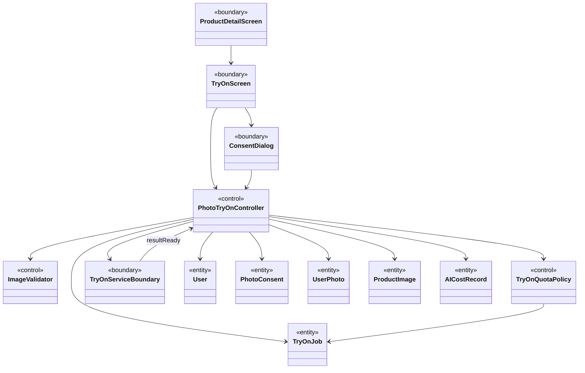
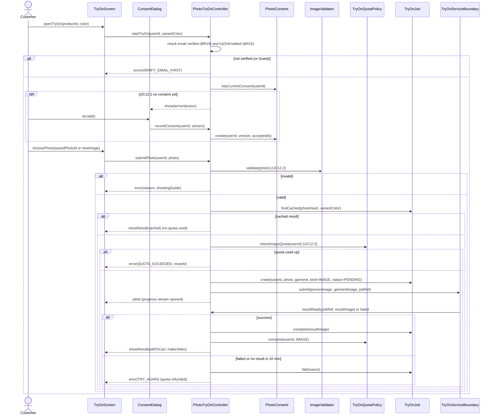

Nguồn: 02-BCE-AND-SEQUENCE.md > Mirra — B2: Phân tích BCE và sequence > 5. Nhóm Thử đồ ảo > UC12 – Try on with photo (gồm UC12.1–UC12.3)
### UC12 – Try on with photo (gồm UC12.1–UC12.3)

```mermaid
classDiagram
  class ProductDetailScreen { <<boundary>> }
  class TryOnScreen { <<boundary>> }
  class ConsentDialog { <<boundary>> }
  class PhotoTryOnController { <<control>> }
  class ImageValidator { <<control>> }
  class TryOnQuotaPolicy { <<control>> }
  class TryOnServiceBoundary { <<boundary>> }
  class User { <<entity>> }
  class PhotoConsent { <<entity>> }
  class UserPhoto { <<entity>> }
  class ProductImage { <<entity>> }
  class TryOnJob { <<entity>> }
  class AICostRecord { <<entity>> }
  ProductDetailScreen --> TryOnScreen
  TryOnScreen --> ConsentDialog
  TryOnScreen --> PhotoTryOnController
  ConsentDialog --> PhotoTryOnController
  TryOnServiceBoundary --> PhotoTryOnController : resultReady
  PhotoTryOnController --> ImageValidator
  PhotoTryOnController --> TryOnQuotaPolicy
  PhotoTryOnController --> TryOnServiceBoundary
  PhotoTryOnController --> User
  PhotoTryOnController --> PhotoConsent
  PhotoTryOnController --> UserPhoto
  PhotoTryOnController --> ProductImage
  PhotoTryOnController --> TryOnJob
  PhotoTryOnController --> AICostRecord
  TryOnQuotaPolicy --> TryOnJob
```

```mermaid
sequenceDiagram
  actor CU as Customer
  participant S as TryOnScreen
  participant CD as ConsentDialog
  participant C as PhotoTryOnController
  participant PC as PhotoConsent
  participant IV as ImageValidator
  participant Q as TryOnQuotaPolicy
  participant J as TryOnJob
  participant TS as TryOnServiceBoundary
  CU->>S: openTryOn(productId, color)
  S->>C: startTryOn(userId, variantColor)
  C->>C: check email verified (BR19) and tryOnEnabled (BR15)
  alt not verified (or Guest)
    C-->>S: error(VERIFY_EMAIL_FIRST)
  else
    C->>PC: hasCurrentConsent(userId)
    opt UC12.1 no consent yet
      C-->>CD: show(termsVersion)
      CU->>CD: accept()
      CD->>C: recordConsent(userId, version)
      C->>PC: create(userId, version, acceptedAt)
    end
    CU->>S: choosePhoto(savedPhotoId or newImage)
    S->>C: submitPhoto(userId, photo)
    C->>IV: validate(photo) (UC12.2)
    alt invalid
      C-->>S: error(reason, shootingGuide)
    else valid
      C->>J: findCached(photoHash, variantColor)
      alt cached result
        C-->>S: showResult(cached) (no quota used)
      else
        C->>Q: checkImageQuota(userId) (UC12.3)
        alt quota used up
          C-->>S: error(QUOTA_EXCEEDED, resetAt)
        else
          C->>J: create(userId, photo, garment, kind=IMAGE, status=PENDING)
          C->>TS: submit(personImage, garmentImage, jobRef)
          C-->>S: jobId (progress stream opened)
          TS->>C: resultReady(jobRef, resultImage) or failed
          alt success
            C->>J: complete(resultImage)
            C->>Q: consume(userId, IMAGE)
            C-->>S: showResult(addToCart, makeVideo)
          else failed or no result in 10 min
            C->>J: fail(reason)
            C-->>S: error(TRY_AGAIN) (quota refunded)
          end
        end
      end
    end
  end
```

