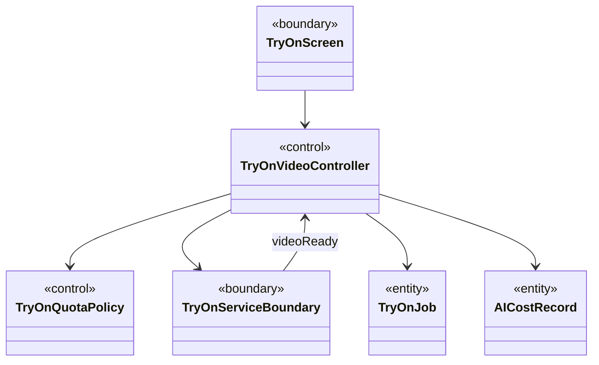
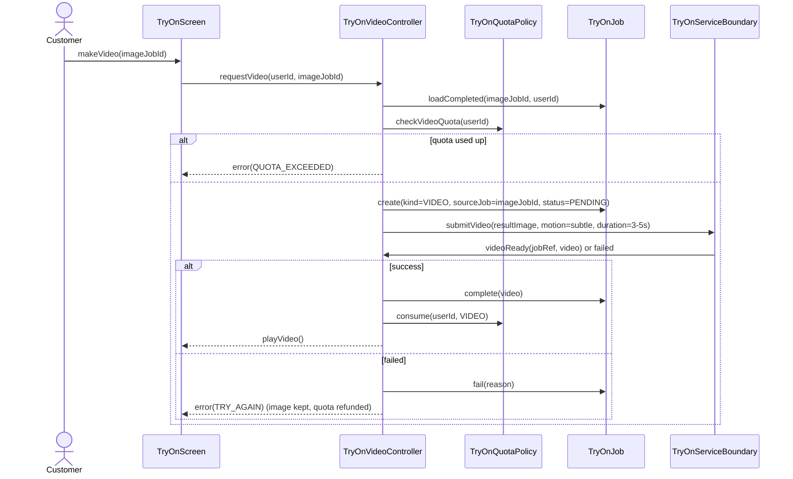

Nguồn: 02-BCE-AND-SEQUENCE.md > Mirra — B2: Phân tích BCE và sequence > 5. Nhóm Thử đồ ảo > UC13 – Generate try-on video
### UC13 – Generate try-on video

```mermaid
classDiagram
  class TryOnScreen { <<boundary>> }
  class TryOnVideoController { <<control>> }
  class TryOnQuotaPolicy { <<control>> }
  class TryOnServiceBoundary { <<boundary>> }
  class TryOnJob { <<entity>> }
  class AICostRecord { <<entity>> }
  TryOnScreen --> TryOnVideoController
  TryOnServiceBoundary --> TryOnVideoController : videoReady
  TryOnVideoController --> TryOnQuotaPolicy
  TryOnVideoController --> TryOnServiceBoundary
  TryOnVideoController --> TryOnJob
  TryOnVideoController --> AICostRecord
```

```mermaid
sequenceDiagram
  actor CU as Customer
  participant S as TryOnScreen
  participant C as TryOnVideoController
  participant Q as TryOnQuotaPolicy
  participant J as TryOnJob
  participant TS as TryOnServiceBoundary
  CU->>S: makeVideo(imageJobId)
  S->>C: requestVideo(userId, imageJobId)
  C->>J: loadCompleted(imageJobId, userId)
  C->>Q: checkVideoQuota(userId)
  alt quota used up
    C-->>S: error(QUOTA_EXCEEDED)
  else
    C->>J: create(kind=VIDEO, sourceJob=imageJobId, status=PENDING)
    C->>TS: submitVideo(resultImage, motion=subtle, duration=3-5s)
    TS->>C: videoReady(jobRef, video) or failed
    alt success
      C->>J: complete(video)
      C->>Q: consume(userId, VIDEO)
      C-->>S: playVideo()
    else failed
      C->>J: fail(reason)
      C-->>S: error(TRY_AGAIN) (image kept, quota refunded)
    end
  end
```

