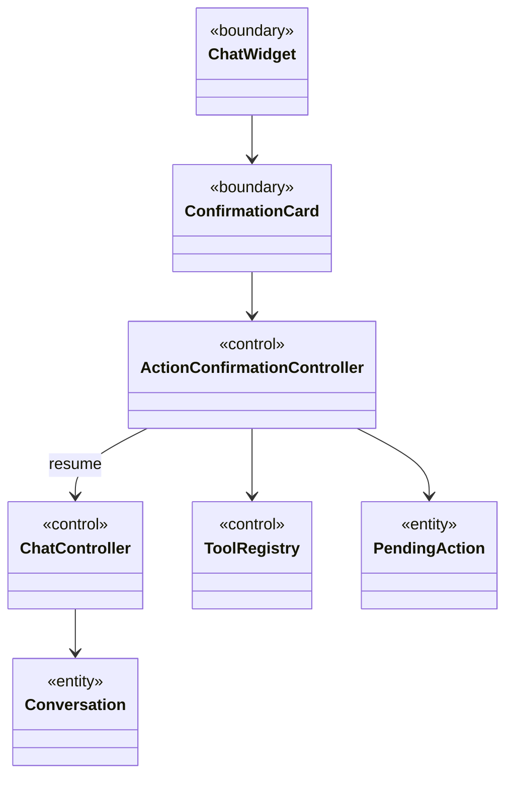
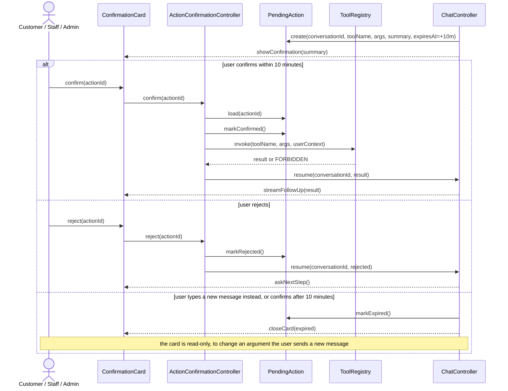

Nguồn: 02-BCE-AND-SEQUENCE.md > Mirra — B2: Phân tích BCE và sequence > 4. Nhóm Trợ lý AI > UC16 – Confirm assistant action
### UC16 – Confirm assistant action

```mermaid
classDiagram
  class ConfirmationCard { <<boundary>> }
  class ChatWidget { <<boundary>> }
  class ActionConfirmationController { <<control>> }
  class ChatController { <<control>> }
  class ToolRegistry { <<control>> }
  class PendingAction { <<entity>> }
  class Conversation { <<entity>> }
  ChatWidget --> ConfirmationCard
  ConfirmationCard --> ActionConfirmationController
  ActionConfirmationController --> PendingAction
  ActionConfirmationController --> ToolRegistry
  ActionConfirmationController --> ChatController : resume
  ChatController --> Conversation
```

```mermaid
sequenceDiagram
  actor A as Customer / Staff / Admin
  participant CC as ConfirmationCard
  participant C as ActionConfirmationController
  participant PA as PendingAction
  participant TR as ToolRegistry
  participant CH as ChatController
  CH->>PA: create(conversationId, toolName, args, summary, expiresAt=+10m)
  CH-->>CC: showConfirmation(summary)
  alt user confirms within 10 minutes
    A->>CC: confirm(actionId)
    CC->>C: confirm(actionId)
    C->>PA: load(actionId)
    C->>PA: markConfirmed()
    C->>TR: invoke(toolName, args, userContext)
    TR-->>C: result or FORBIDDEN
    C->>CH: resume(conversationId, result)
    CH-->>CC: streamFollowUp(result)
  else user rejects
    A->>CC: reject(actionId)
    CC->>C: reject(actionId)
    C->>PA: markRejected()
    C->>CH: resume(conversationId, rejected)
    CH-->>CC: askNextStep()
  else user types a new message instead, or confirms after 10 minutes
    CH->>PA: markExpired()
    CH-->>CC: closeCard(expired)
    Note over A,CH: the card is read-only, to change an argument the user sends a new message
  end
```

