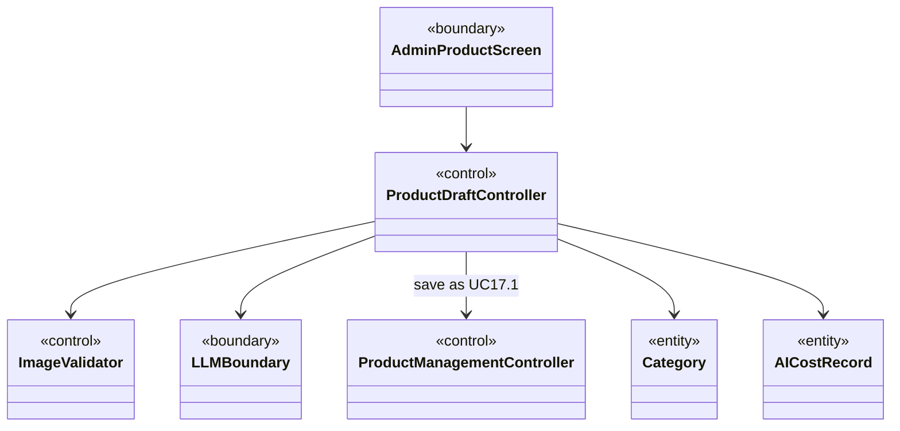
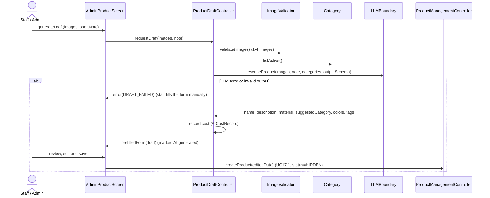

Nguồn: 02-BCE-AND-SEQUENCE.md > Mirra — B2: Phân tích BCE và sequence > 6. Nhóm Vận hành > UC18 – Create AI product draft (extend UC17.1)
### UC18 – Create AI product draft (extend UC17.1)

```mermaid
classDiagram
  class AdminProductScreen { <<boundary>> }
  class ProductDraftController { <<control>> }
  class ImageValidator { <<control>> }
  class ProductManagementController { <<control>> }
  class LLMBoundary { <<boundary>> }
  class Category { <<entity>> }
  class AICostRecord { <<entity>> }
  AdminProductScreen --> ProductDraftController
  ProductDraftController --> ImageValidator
  ProductDraftController --> LLMBoundary
  ProductDraftController --> ProductManagementController : save as UC17.1
  ProductDraftController --> Category
  ProductDraftController --> AICostRecord
```

```mermaid
sequenceDiagram
  actor ST as Staff / Admin
  participant S as AdminProductScreen
  participant C as ProductDraftController
  participant IV as ImageValidator
  participant CA as Category
  participant L as LLMBoundary
  participant PM as ProductManagementController
  ST->>S: generateDraft(images, shortNote)
  S->>C: requestDraft(images, note)
  C->>IV: validate(images) (1-4 images)
  C->>CA: listActive()
  C->>L: describeProduct(images, note, categories, outputSchema)
  alt LLM error or invalid output
    C-->>S: error(DRAFT_FAILED) (staff fills the form manually)
  else
    L-->>C: name, description, material, suggestedCategory, colors, tags
    C->>C: record cost (AICostRecord)
    C-->>S: prefilledForm(draft) (marked AI-generated)
    ST->>S: review, edit and save
    S->>PM: createProduct(editedData) (UC17.1, status=HIDDEN)
  end
```

