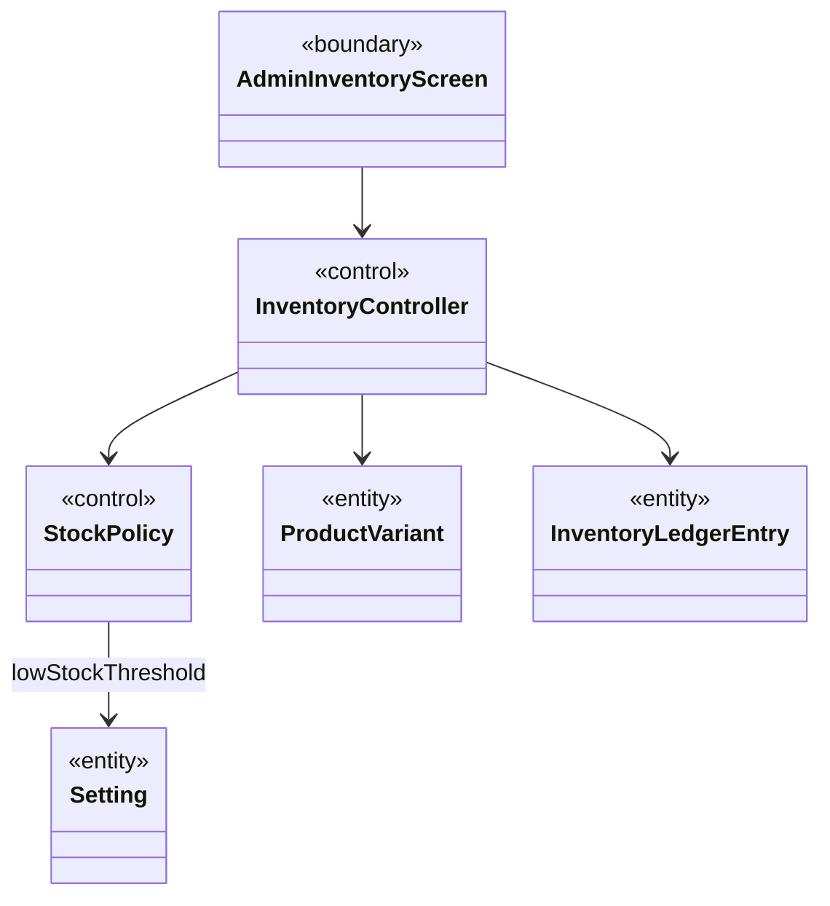
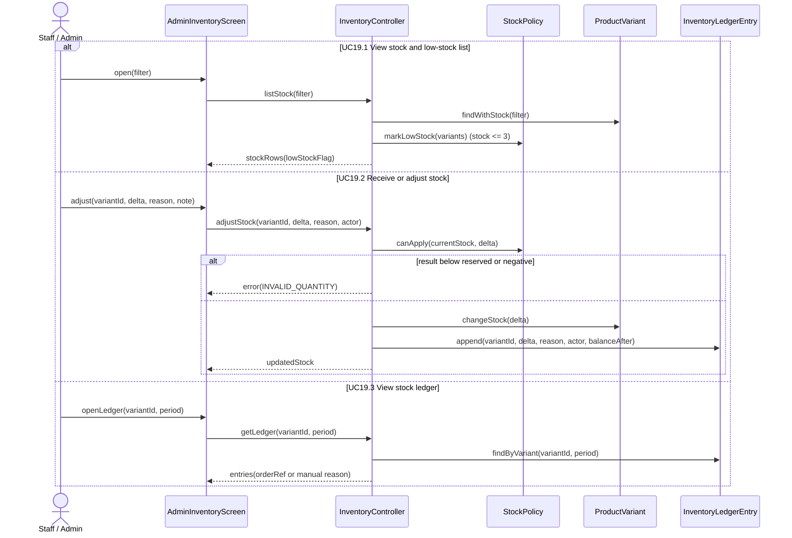

Nguồn: 02-BCE-AND-SEQUENCE.md > Mirra — B2: Phân tích BCE và sequence > 6. Nhóm Vận hành > UC19 – Manage inventory (UC19.1–UC19.3)
### UC19 – Manage inventory (UC19.1–UC19.3)

```mermaid
classDiagram
  class AdminInventoryScreen { <<boundary>> }
  class InventoryController { <<control>> }
  class StockPolicy { <<control>> }
  class ProductVariant { <<entity>> }
  class InventoryLedgerEntry { <<entity>> }
  class Setting { <<entity>> }
  AdminInventoryScreen --> InventoryController
  InventoryController --> StockPolicy
  InventoryController --> ProductVariant
  InventoryController --> InventoryLedgerEntry
  StockPolicy --> Setting : lowStockThreshold
```

```mermaid
sequenceDiagram
  actor ST as Staff / Admin
  participant S as AdminInventoryScreen
  participant C as InventoryController
  participant SP as StockPolicy
  participant V as ProductVariant
  participant L as InventoryLedgerEntry
  alt UC19.1 View stock and low-stock list
    ST->>S: open(filter)
    S->>C: listStock(filter)
    C->>V: findWithStock(filter)
    C->>SP: markLowStock(variants) (stock <= 3)
    C-->>S: stockRows(lowStockFlag)
  else UC19.2 Receive or adjust stock
    ST->>S: adjust(variantId, delta, reason, note)
    S->>C: adjustStock(variantId, delta, reason, actor)
    C->>SP: canApply(currentStock, delta)
    alt result below reserved or negative
      C-->>S: error(INVALID_QUANTITY)
    else
      C->>V: changeStock(delta)
      C->>L: append(variantId, delta, reason, actor, balanceAfter)
      C-->>S: updatedStock
    end
  else UC19.3 View stock ledger
    ST->>S: openLedger(variantId, period)
    S->>C: getLedger(variantId, period)
    C->>L: findByVariant(variantId, period)
    C-->>S: entries(orderRef or manual reason)
  end
```

