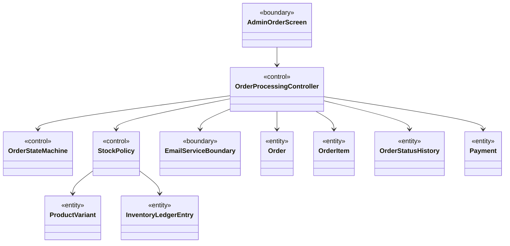
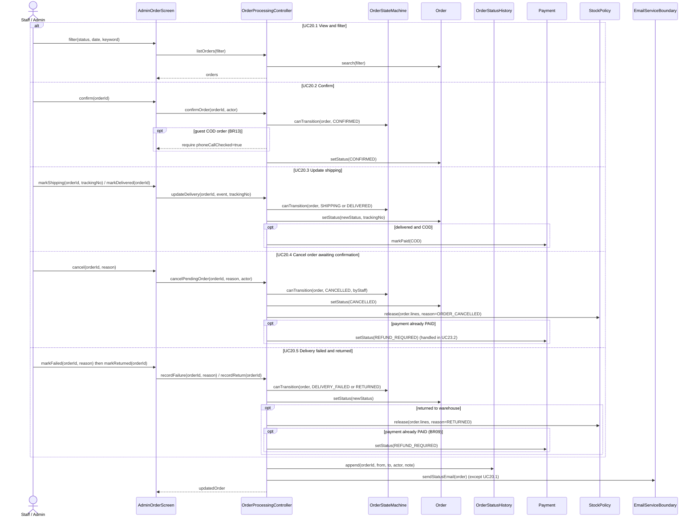

Nguồn: 02-BCE-AND-SEQUENCE.md > Mirra — B2: Phân tích BCE và sequence > 6. Nhóm Vận hành > UC20 – Process orders (UC20.1–UC20.5)
### UC20 – Process orders (UC20.1–UC20.5)

```mermaid
classDiagram
  class AdminOrderScreen { <<boundary>> }
  class OrderProcessingController { <<control>> }
  class OrderStateMachine { <<control>> }
  class StockPolicy { <<control>> }
  class EmailServiceBoundary { <<boundary>> }
  class Order { <<entity>> }
  class OrderItem { <<entity>> }
  class OrderStatusHistory { <<entity>> }
  class Payment { <<entity>> }
  class ProductVariant { <<entity>> }
  class InventoryLedgerEntry { <<entity>> }
  AdminOrderScreen --> OrderProcessingController
  OrderProcessingController --> OrderStateMachine
  OrderProcessingController --> StockPolicy
  OrderProcessingController --> EmailServiceBoundary
  OrderProcessingController --> Order
  OrderProcessingController --> OrderItem
  OrderProcessingController --> OrderStatusHistory
  OrderProcessingController --> Payment
  StockPolicy --> ProductVariant
  StockPolicy --> InventoryLedgerEntry
```

```mermaid
sequenceDiagram
  actor ST as Staff / Admin
  participant S as AdminOrderScreen
  participant C as OrderProcessingController
  participant SM as OrderStateMachine
  participant O as Order
  participant H as OrderStatusHistory
  participant PY as Payment
  participant SP as StockPolicy
  participant M as EmailServiceBoundary
  alt UC20.1 View and filter
    ST->>S: filter(status, date, keyword)
    S->>C: listOrders(filter)
    C->>O: search(filter)
    C-->>S: orders
  else UC20.2 Confirm
    ST->>S: confirm(orderId)
    S->>C: confirmOrder(orderId, actor)
    C->>SM: canTransition(order, CONFIRMED)
    opt guest COD order (BR13)
      C-->>S: require phoneCallChecked=true
    end
    C->>O: setStatus(CONFIRMED)
  else UC20.3 Update shipping
    ST->>S: markShipping(orderId, trackingNo) / markDelivered(orderId)
    S->>C: updateDelivery(orderId, event, trackingNo)
    C->>SM: canTransition(order, SHIPPING or DELIVERED)
    C->>O: setStatus(newStatus, trackingNo)
    opt delivered and COD
      C->>PY: markPaid(COD)
    end
  else UC20.4 Cancel order awaiting confirmation
    ST->>S: cancel(orderId, reason)
    S->>C: cancelPendingOrder(orderId, reason, actor)
    C->>SM: canTransition(order, CANCELLED, byStaff)
    C->>O: setStatus(CANCELLED)
    C->>SP: release(order.lines, reason=ORDER_CANCELLED)
    opt payment already PAID
      C->>PY: setStatus(REFUND_REQUIRED) (handled in UC23.2)
    end
  else UC20.5 Delivery failed and returned
    ST->>S: markFailed(orderId, reason) then markReturned(orderId)
    S->>C: recordFailure(orderId, reason) / recordReturn(orderId)
    C->>SM: canTransition(order, DELIVERY_FAILED or RETURNED)
    C->>O: setStatus(newStatus)
    opt returned to warehouse
      C->>SP: release(order.lines, reason=RETURNED)
      opt payment already PAID (BR09)
        C->>PY: setStatus(REFUND_REQUIRED)
      end
    end
  end
  C->>H: append(orderId, from, to, actor, note)
  C->>M: sendStatusEmail(order) (except UC20.1)
  C-->>S: updatedOrder
```

