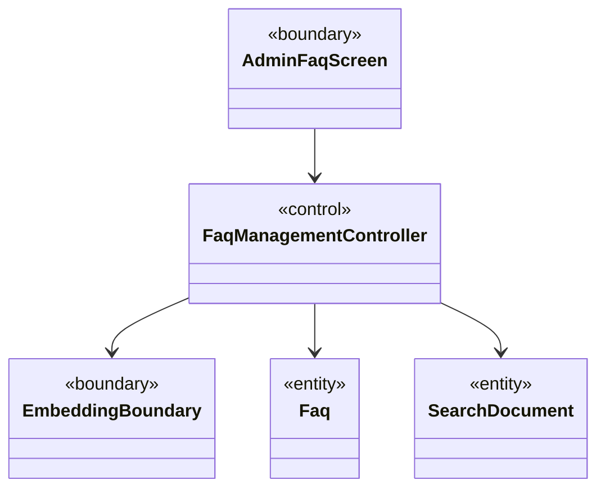
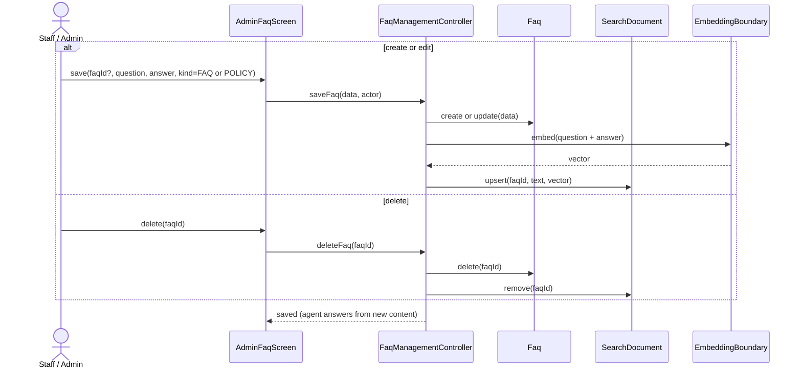

Nguồn: 02-BCE-AND-SEQUENCE.md > Mirra — B2: Phân tích BCE và sequence > 6. Nhóm Vận hành > UC21 – Manage FAQ and policies (UC21.1)
### UC21 – Manage FAQ and policies (UC21.1)

```mermaid
classDiagram
  class AdminFaqScreen { <<boundary>> }
  class FaqManagementController { <<control>> }
  class EmbeddingBoundary { <<boundary>> }
  class Faq { <<entity>> }
  class SearchDocument { <<entity>> }
  AdminFaqScreen --> FaqManagementController
  FaqManagementController --> EmbeddingBoundary
  FaqManagementController --> Faq
  FaqManagementController --> SearchDocument
```

```mermaid
sequenceDiagram
  actor ST as Staff / Admin
  participant S as AdminFaqScreen
  participant C as FaqManagementController
  participant F as Faq
  participant SD as SearchDocument
  participant E as EmbeddingBoundary
  alt create or edit
    ST->>S: save(faqId?, question, answer, kind=FAQ or POLICY)
    S->>C: saveFaq(data, actor)
    C->>F: create or update(data)
    C->>E: embed(question + answer)
    E-->>C: vector
    C->>SD: upsert(faqId, text, vector)
  else delete
    ST->>S: delete(faqId)
    S->>C: deleteFaq(faqId)
    C->>F: delete(faqId)
    C->>SD: remove(faqId)
  end
  C-->>S: saved (agent answers from new content)
```

