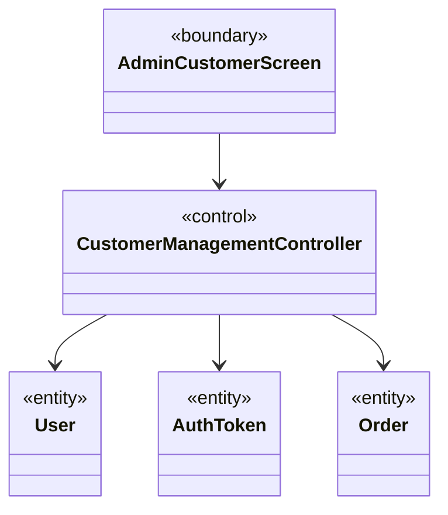
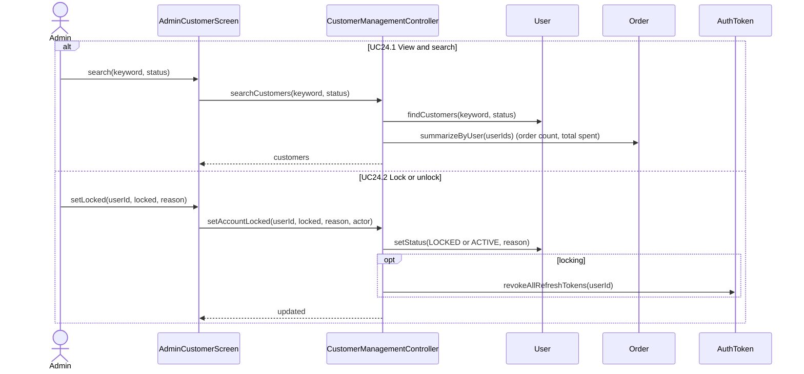

Nguồn: 02-BCE-AND-SEQUENCE.md > Mirra — B2: Phân tích BCE và sequence > 7. Nhóm Quản trị > UC24 – Manage customers (UC24.1–UC24.2)
### UC24 – Manage customers (UC24.1–UC24.2)

```mermaid
classDiagram
  class AdminCustomerScreen { <<boundary>> }
  class CustomerManagementController { <<control>> }
  class User { <<entity>> }
  class AuthToken { <<entity>> }
  class Order { <<entity>> }
  AdminCustomerScreen --> CustomerManagementController
  CustomerManagementController --> User
  CustomerManagementController --> AuthToken
  CustomerManagementController --> Order
```

```mermaid
sequenceDiagram
  actor AD as Admin
  participant S as AdminCustomerScreen
  participant C as CustomerManagementController
  participant U as User
  participant O as Order
  participant T as AuthToken
  alt UC24.1 View and search
    AD->>S: search(keyword, status)
    S->>C: searchCustomers(keyword, status)
    C->>U: findCustomers(keyword, status)
    C->>O: summarizeByUser(userIds) (order count, total spent)
    C-->>S: customers
  else UC24.2 Lock or unlock
    AD->>S: setLocked(userId, locked, reason)
    S->>C: setAccountLocked(userId, locked, reason, actor)
    C->>U: setStatus(LOCKED or ACTIVE, reason)
    opt locking
      C->>T: revokeAllRefreshTokens(userId)
    end
    C-->>S: updated
  end
```

