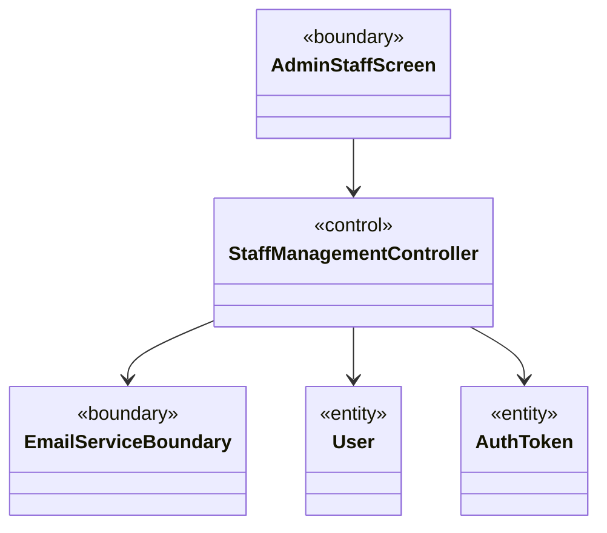
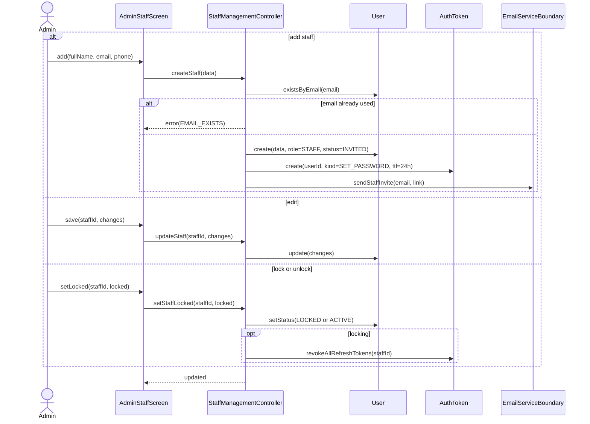

Nguồn: 02-BCE-AND-SEQUENCE.md > Mirra — B2: Phân tích BCE và sequence > 7. Nhóm Quản trị > UC25 – Manage staff (UC25.1)
### UC25 – Manage staff (UC25.1)

```mermaid
classDiagram
  class AdminStaffScreen { <<boundary>> }
  class StaffManagementController { <<control>> }
  class EmailServiceBoundary { <<boundary>> }
  class User { <<entity>> }
  class AuthToken { <<entity>> }
  AdminStaffScreen --> StaffManagementController
  StaffManagementController --> EmailServiceBoundary
  StaffManagementController --> User
  StaffManagementController --> AuthToken
```

```mermaid
sequenceDiagram
  actor AD as Admin
  participant S as AdminStaffScreen
  participant C as StaffManagementController
  participant U as User
  participant T as AuthToken
  participant M as EmailServiceBoundary
  alt add staff
    AD->>S: add(fullName, email, phone)
    S->>C: createStaff(data)
    C->>U: existsByEmail(email)
    alt email already used
      C-->>S: error(EMAIL_EXISTS)
    else
      C->>U: create(data, role=STAFF, status=INVITED)
      C->>T: create(userId, kind=SET_PASSWORD, ttl=24h)
      C->>M: sendStaffInvite(email, link)
    end
  else edit
    AD->>S: save(staffId, changes)
    S->>C: updateStaff(staffId, changes)
    C->>U: update(changes)
  else lock or unlock
    AD->>S: setLocked(staffId, locked)
    S->>C: setStaffLocked(staffId, locked)
    C->>U: setStatus(LOCKED or ACTIVE)
    opt locking
      C->>T: revokeAllRefreshTokens(staffId)
    end
  end
  C-->>S: updated
```

