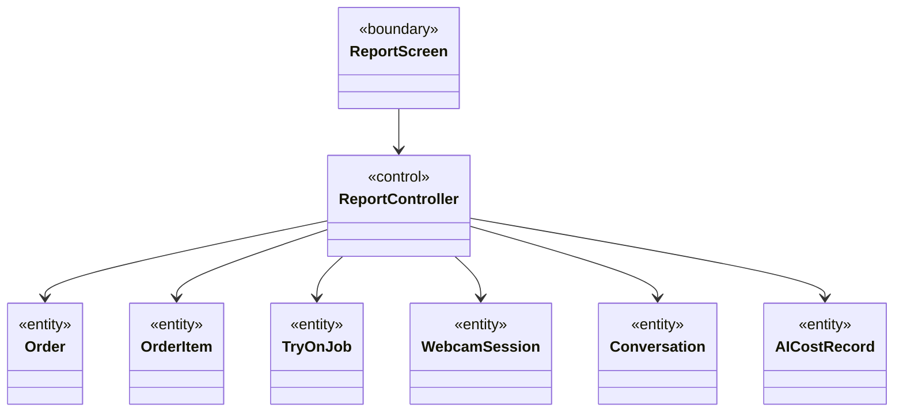
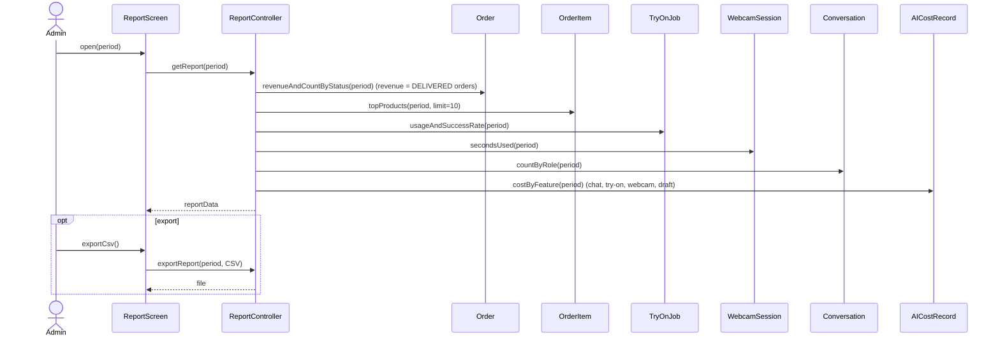

Nguồn: 02-BCE-AND-SEQUENCE.md > Mirra — B2: Phân tích BCE và sequence > 7. Nhóm Quản trị > UC26 – View reports
### UC26 – View reports

```mermaid
classDiagram
  class ReportScreen { <<boundary>> }
  class ReportController { <<control>> }
  class Order { <<entity>> }
  class OrderItem { <<entity>> }
  class TryOnJob { <<entity>> }
  class WebcamSession { <<entity>> }
  class Conversation { <<entity>> }
  class AICostRecord { <<entity>> }
  ReportScreen --> ReportController
  ReportController --> Order
  ReportController --> OrderItem
  ReportController --> TryOnJob
  ReportController --> WebcamSession
  ReportController --> Conversation
  ReportController --> AICostRecord
```

```mermaid
sequenceDiagram
  actor AD as Admin
  participant S as ReportScreen
  participant C as ReportController
  participant O as Order
  participant OI as OrderItem
  participant J as TryOnJob
  participant W as WebcamSession
  participant CV as Conversation
  participant K as AICostRecord
  AD->>S: open(period)
  S->>C: getReport(period)
  C->>O: revenueAndCountByStatus(period) (revenue = DELIVERED orders)
  C->>OI: topProducts(period, limit=10)
  C->>J: usageAndSuccessRate(period)
  C->>W: secondsUsed(period)
  C->>CV: countByRole(period)
  C->>K: costByFeature(period) (chat, try-on, webcam, draft)
  C-->>S: reportData
  opt export
    AD->>S: exportCsv()
    S->>C: exportReport(period, CSV)
    C-->>S: file
  end
```

