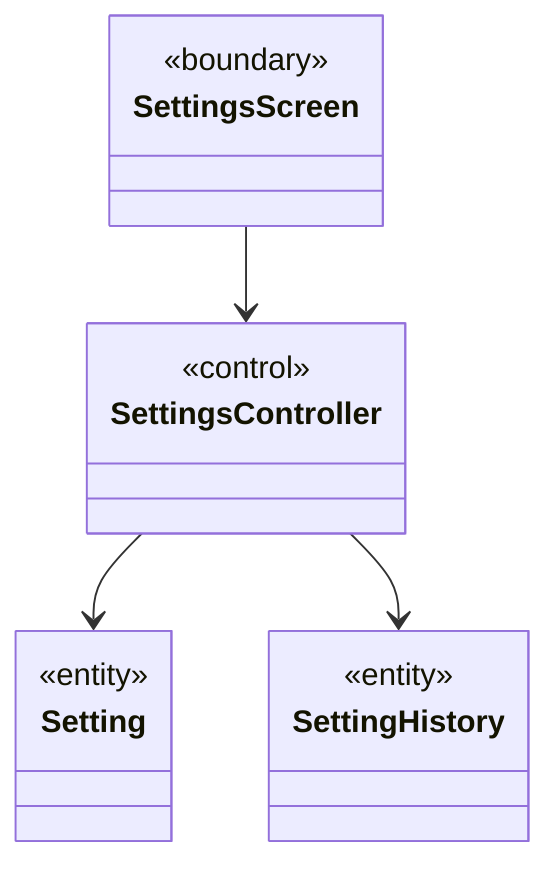
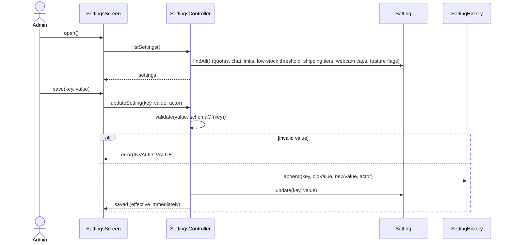

Nguồn: 02-BCE-AND-SEQUENCE.md > Mirra — B2: Phân tích BCE và sequence > 7. Nhóm Quản trị > UC27 – Configure system
### UC27 – Configure system

```mermaid
classDiagram
  class SettingsScreen { <<boundary>> }
  class SettingsController { <<control>> }
  class Setting { <<entity>> }
  class SettingHistory { <<entity>> }
  SettingsScreen --> SettingsController
  SettingsController --> Setting
  SettingsController --> SettingHistory
```

```mermaid
sequenceDiagram
  actor AD as Admin
  participant S as SettingsScreen
  participant C as SettingsController
  participant ST as Setting
  participant H as SettingHistory
  AD->>S: open()
  S->>C: listSettings()
  C->>ST: findAll() (quotas, chat limits, low-stock threshold, shipping tiers, webcam caps, feature flags)
  C-->>S: settings
  AD->>S: save(key, value)
  S->>C: updateSetting(key, value, actor)
  C->>C: validate(value, schemaOf(key))
  alt invalid value
    C-->>S: error(INVALID_VALUE)
  else
    C->>H: append(key, oldValue, newValue, actor)
    C->>ST: update(key, value)
    C-->>S: saved (effective immediately)
  end
```

