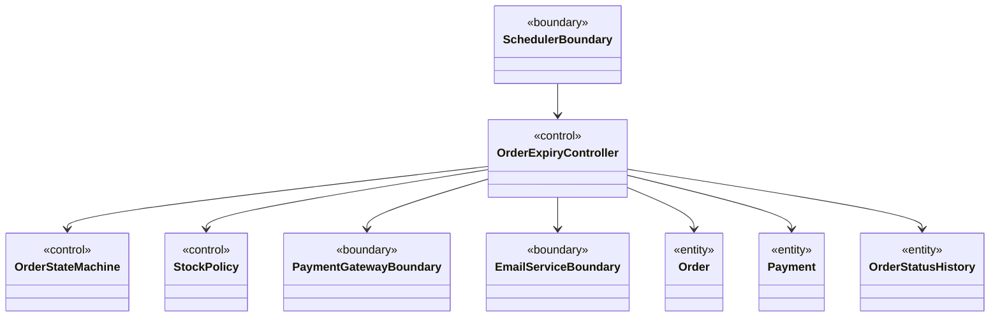
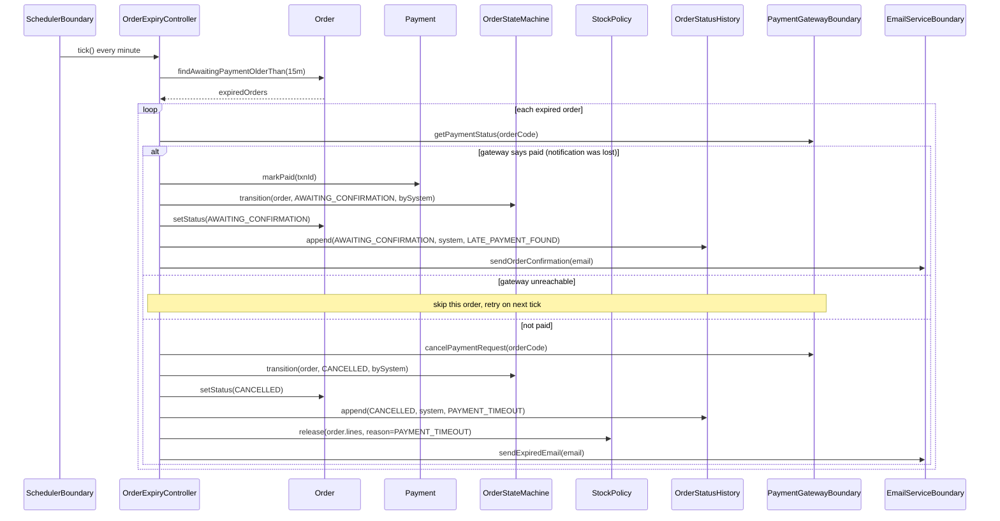

Nguồn: 02-BCE-AND-SEQUENCE.md > Mirra — B2: Phân tích BCE và sequence > 3. Nhóm Mua hàng > UC29 – Auto-cancel expired unpaid orders
### UC29 – Auto-cancel expired unpaid orders

```mermaid
classDiagram
  class SchedulerBoundary { <<boundary>> }
  class OrderExpiryController { <<control>> }
  class OrderStateMachine { <<control>> }
  class StockPolicy { <<control>> }
  class PaymentGatewayBoundary { <<boundary>> }
  class EmailServiceBoundary { <<boundary>> }
  class Order { <<entity>> }
  class Payment { <<entity>> }
  class OrderStatusHistory { <<entity>> }
  SchedulerBoundary --> OrderExpiryController
  OrderExpiryController --> OrderStateMachine
  OrderExpiryController --> StockPolicy
  OrderExpiryController --> PaymentGatewayBoundary
  OrderExpiryController --> EmailServiceBoundary
  OrderExpiryController --> Order
  OrderExpiryController --> Payment
  OrderExpiryController --> OrderStatusHistory
```

```mermaid
sequenceDiagram
  participant T as SchedulerBoundary
  participant C as OrderExpiryController
  participant O as Order
  participant PM as Payment
  participant SM as OrderStateMachine
  participant SP as StockPolicy
  participant SH as OrderStatusHistory
  participant GW as PaymentGatewayBoundary
  participant E as EmailServiceBoundary
  T->>C: tick() every minute
  C->>O: findAwaitingPaymentOlderThan(15m)
  O-->>C: expiredOrders
  loop each expired order
    C->>GW: getPaymentStatus(orderCode)
    alt gateway says paid (notification was lost)
      C->>PM: markPaid(txnId)
      C->>SM: transition(order, AWAITING_CONFIRMATION, bySystem)
      C->>O: setStatus(AWAITING_CONFIRMATION)
      C->>SH: append(AWAITING_CONFIRMATION, system, LATE_PAYMENT_FOUND)
      C->>E: sendOrderConfirmation(email)
    else gateway unreachable
      Note over C,GW: skip this order, retry on next tick
    else not paid
      C->>GW: cancelPaymentRequest(orderCode)
      C->>SM: transition(order, CANCELLED, bySystem)
      C->>O: setStatus(CANCELLED)
      C->>SH: append(CANCELLED, system, PAYMENT_TIMEOUT)
      C->>SP: release(order.lines, reason=PAYMENT_TIMEOUT)
      C->>E: sendExpiredEmail(email)
    end
  end
```

