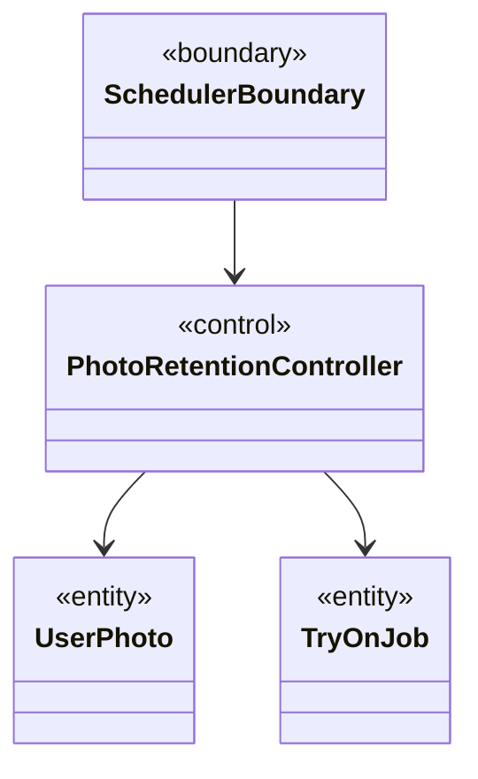
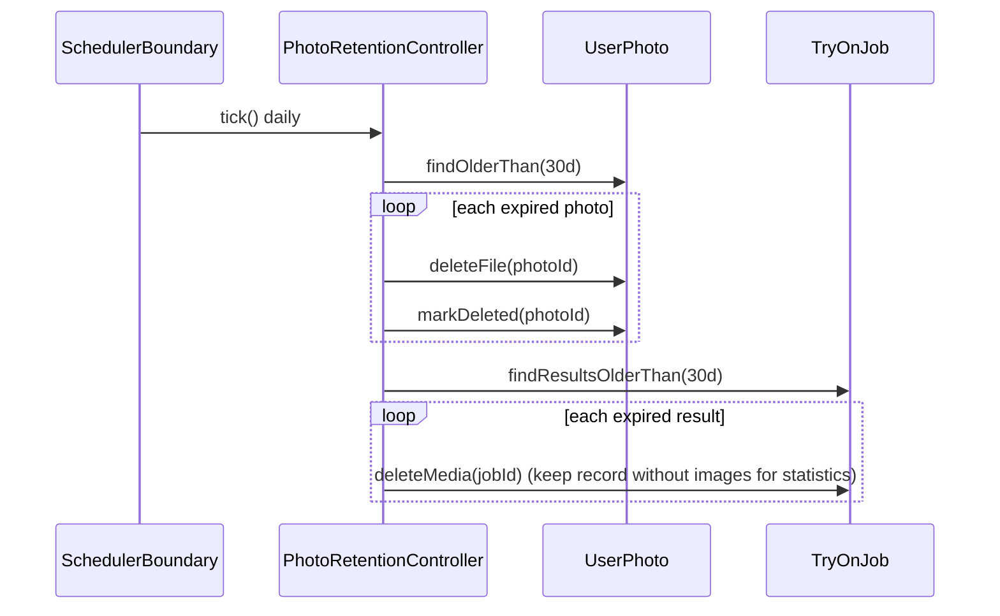

Nguồn: 02-BCE-AND-SEQUENCE.md > Mirra — B2: Phân tích BCE và sequence > 5. Nhóm Thử đồ ảo > UC30 – Auto-delete expired user photos
### UC30 – Auto-delete expired user photos

```mermaid
classDiagram
  class SchedulerBoundary { <<boundary>> }
  class PhotoRetentionController { <<control>> }
  class UserPhoto { <<entity>> }
  class TryOnJob { <<entity>> }
  SchedulerBoundary --> PhotoRetentionController
  PhotoRetentionController --> UserPhoto
  PhotoRetentionController --> TryOnJob
```

```mermaid
sequenceDiagram
  participant T as SchedulerBoundary
  participant C as PhotoRetentionController
  participant P as UserPhoto
  participant J as TryOnJob
  T->>C: tick() daily
  C->>P: findOlderThan(30d)
  loop each expired photo
    C->>P: deleteFile(photoId)
    C->>P: markDeleted(photoId)
  end
  C->>J: findResultsOlderThan(30d)
  loop each expired result
    C->>J: deleteMedia(jobId) (keep record without images for statistics)
  end
```

