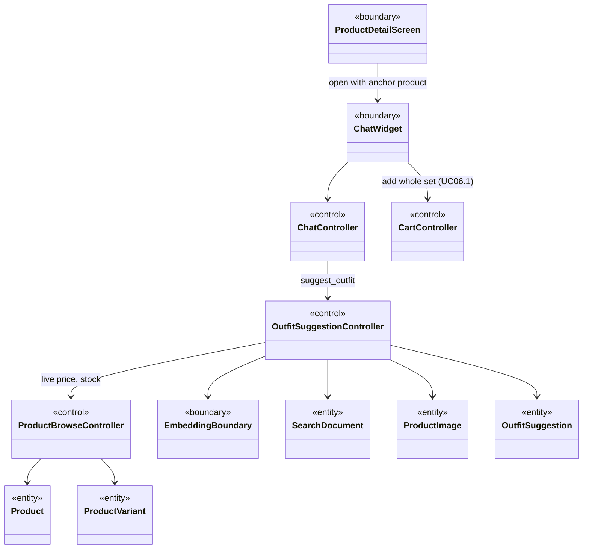
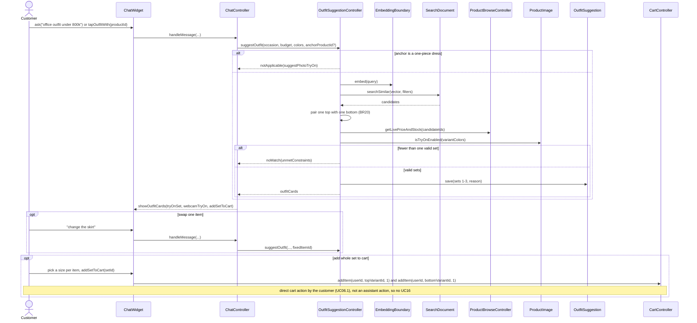

Nguồn: 02-BCE-AND-SEQUENCE.md > Mirra — B2: Phân tích BCE và sequence > 4. Nhóm Trợ lý AI > UC31 – Suggest outfits with assistant
### UC31 – Suggest outfits with assistant

```mermaid
classDiagram
  class ChatWidget { <<boundary>> }
  class ProductDetailScreen { <<boundary>> }
  class ChatController { <<control>> }
  class OutfitSuggestionController { <<control>> }
  class ProductBrowseController { <<control>> }
  class EmbeddingBoundary { <<boundary>> }
  class SearchDocument { <<entity>> }
  class Product { <<entity>> }
  class ProductVariant { <<entity>> }
  class ProductImage { <<entity>> }
  class OutfitSuggestion { <<entity>> }
  class CartController { <<control>> }
  ProductDetailScreen --> ChatWidget : open with anchor product
  ChatWidget --> ChatController
  ChatController --> OutfitSuggestionController : suggest_outfit
  OutfitSuggestionController --> EmbeddingBoundary
  OutfitSuggestionController --> SearchDocument
  OutfitSuggestionController --> ProductBrowseController : live price, stock
  OutfitSuggestionController --> ProductImage
  OutfitSuggestionController --> OutfitSuggestion
  ProductBrowseController --> Product
  ProductBrowseController --> ProductVariant
  ChatWidget --> CartController : add whole set (UC06.1)
```

```mermaid
sequenceDiagram
  actor CU as Customer
  participant W as ChatWidget
  participant CH as ChatController
  participant OC as OutfitSuggestionController
  participant EB as EmbeddingBoundary
  participant SD as SearchDocument
  participant PB as ProductBrowseController
  participant IM as ProductImage
  participant OS as OutfitSuggestion
  participant K as CartController
  CU->>W: ask("office outfit under 800k") or tapOutfitWith(productId)
  W->>CH: handleMessage(...)
  CH->>OC: suggestOutfit(occasion, budget, colors, anchorProductId?)
  alt anchor is a one-piece dress
    OC-->>CH: notApplicable(suggestPhotoTryOn)
  else
    OC->>EB: embed(query)
    OC->>SD: searchSimilar(vector, filters)
    SD-->>OC: candidates
    OC->>OC: pair one top with one bottom (BR20)
    OC->>PB: getLivePriceAndStock(candidateIds)
    OC->>IM: isTryOnEnabled(variantColors)
    alt fewer than one valid set
      OC-->>CH: noMatch(unmetConstraints)
    else valid sets
      OC->>OS: save(sets 1-3, reason)
      OC-->>CH: outfitCards
    end
  end
  CH-->>W: showOutfitCards(tryOnSet, webcamTryOn, addSetToCart)
  opt swap one item
    CU->>W: "change the skirt"
    W->>CH: handleMessage(...)
    CH->>OC: suggestOutfit(..., fixedItemId)
  end
  opt add whole set to cart
    CU->>W: pick a size per item, addSetToCart(setId)
    W->>K: addItem(userId, topVariantId, 1) and addItem(userId, bottomVariantId, 1)
    Note over CU,K: direct cart action by the customer (UC06.1), not an assistant action, so no UC16
  end
```

