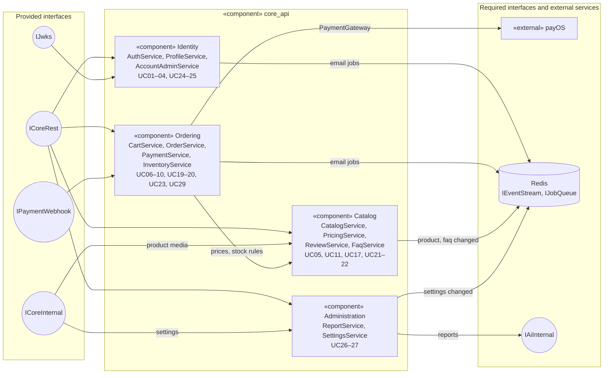

Nguồn: 03-PACKAGE-COMPONENT-DEPLOYMENT.md > Mirra — B3: Package, Component, Deployment > 4. Sơ đồ component > 4.2 Bên trong core\_api
### 4.2 Bên trong core\_api

```mermaid
flowchart LR
  subgraph PROV["Provided interfaces"]
    I_REST(("ICoreRest"))
    I_JWKS(("IJwks"))
    I_CINT(("ICoreInternal"))
    I_WH(("IPaymentWebhook"))
  end
  subgraph CORE["«component» core_api"]
    ID["«component» Identity<br/>AuthService, ProfileService,<br/>AccountAdminService<br/>UC01–04, UC24–25"]
    CAT["«component» Catalog<br/>CatalogService, PricingService,<br/>ReviewService, FaqService<br/>UC05, UC11, UC17, UC21–22"]
    ORD["«component» Ordering<br/>CartService, OrderService,<br/>PaymentService, InventoryService<br/>UC06–10, UC19–20, UC23, UC29"]
    ADM["«component» Administration<br/>ReportService, SettingsService<br/>UC26–27"]
  end
  subgraph REQ["Required interfaces and external services"]
    PAY["«external» payOS"]
    RD[("Redis<br/>IEventStream, IJobQueue")]
    I_AINT(("IAiInternal"))
  end
  I_REST --> ID
  I_REST --> CAT
  I_REST --> ORD
  I_REST --> ADM
  I_JWKS --> ID
  I_CINT -->|settings| ADM
  I_CINT -->|product media| CAT
  I_WH --> ORD
  ORD -->|"prices, stock rules"| CAT
  ORD -->|PaymentGateway| PAY
  ID -->|email jobs| RD
  ORD -->|"email jobs"| RD
  CAT -->|"product, faq changed"| RD
  ADM -->|settings changed| RD
  ADM -->|reports| I_AINT
```

