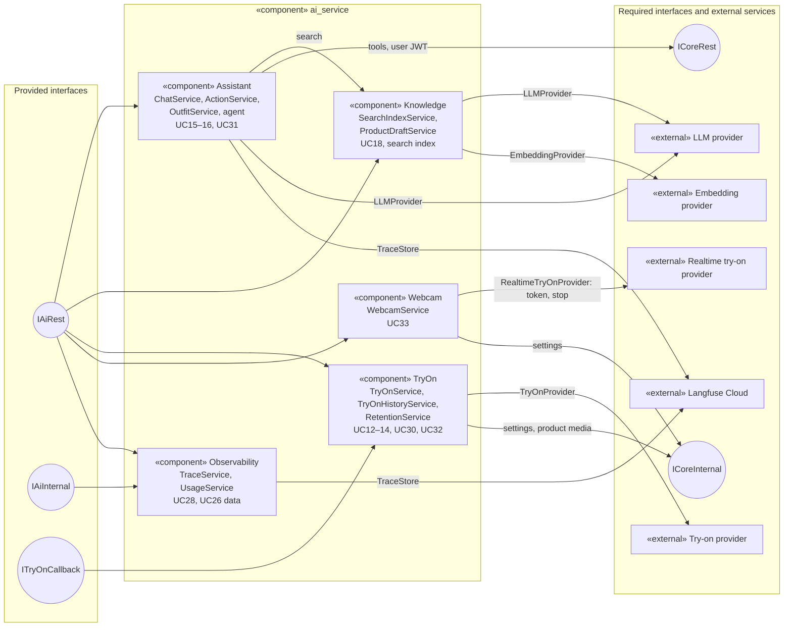

Nguồn: 03-PACKAGE-COMPONENT-DEPLOYMENT.md > Mirra — B3: Package, Component, Deployment > 4. Sơ đồ component > 4.3 Bên trong ai\_service
### 4.3 Bên trong ai\_service

```mermaid
flowchart LR
  subgraph PROV["Provided interfaces"]
    I_AIR(("IAiRest"))
    I_AINT(("IAiInternal"))
    I_CB(("ITryOnCallback"))
  end
  subgraph AI["«component» ai_service"]
    AST["«component» Assistant<br/>ChatService, ActionService,<br/>OutfitService, agent<br/>UC15–16, UC31"]
    KNW["«component» Knowledge<br/>SearchIndexService,<br/>ProductDraftService<br/>UC18, search index"]
    TRY["«component» TryOn<br/>TryOnService, TryOnHistoryService,<br/>RetentionService<br/>UC12–14, UC30, UC32"]
    CAM["«component» Webcam<br/>WebcamService<br/>UC33"]
    OBS["«component» Observability<br/>TraceService, UsageService<br/>UC28, UC26 data"]
  end
  subgraph REQ["Required interfaces and external services"]
    I_REST(("ICoreRest"))
    I_CINT(("ICoreInternal"))
    LLM["«external» LLM provider"]
    EMB["«external» Embedding provider"]
    TP["«external» Try-on provider"]
    RT["«external» Realtime try-on provider"]
    LF["«external» Langfuse Cloud"]
  end
  I_AIR --> AST
  I_AIR --> KNW
  I_AIR --> TRY
  I_AIR --> CAM
  I_AIR --> OBS
  I_AINT --> OBS
  I_CB --> TRY
  AST -->|search| KNW
  AST -->|"tools, user JWT"| I_REST
  AST -->|LLMProvider| LLM
  AST -->|TraceStore| LF
  KNW -->|LLMProvider| LLM
  KNW -->|EmbeddingProvider| EMB
  TRY -->|TryOnProvider| TP
  TRY -->|"settings, product media"| I_CINT
  CAM -->|"RealtimeTryOnProvider: token, stop"| RT
  CAM -->|settings| I_CINT
  OBS -->|TraceStore| LF
```

