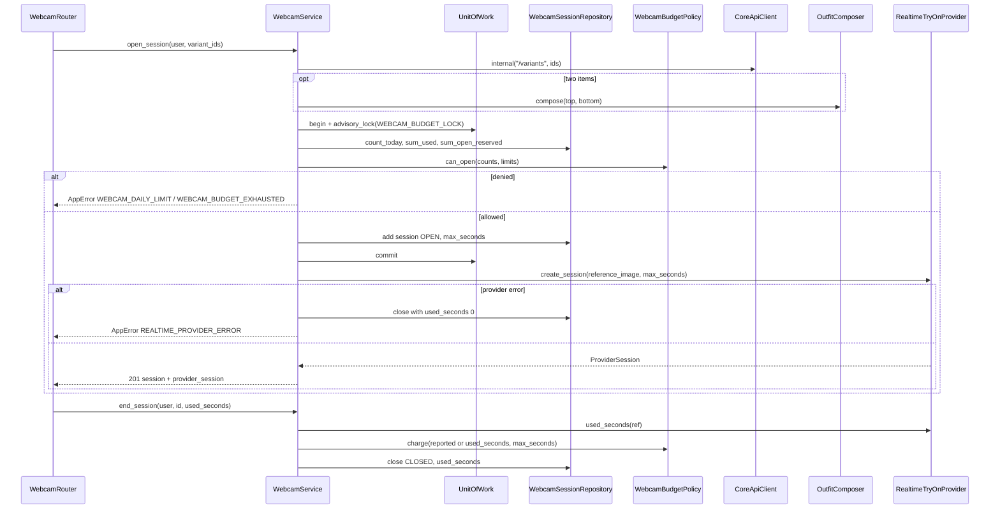

Nguồn: 06-CLASS-AND-DESIGN-PATTERN.md > Mirra — B6: Thiết kế lớp và design pattern > 5. Sequence mức thiết kế > 5.5 Mở và đóng phiên webcam (UC33)
### 5.5 Mở và đóng phiên webcam (UC33)

```mermaid
sequenceDiagram
  participant R as WebcamRouter
  participant S as WebcamService
  participant U as UnitOfWork
  participant WR as WebcamSessionRepository
  participant BP as WebcamBudgetPolicy
  participant K as CoreApiClient
  participant OC as OutfitComposer
  participant RT as RealtimeTryOnProvider
  R->>S: open_session(user, variant_ids)
  S->>K: internal("/variants", ids)
  opt two items
    S->>OC: compose(top, bottom)
  end
  S->>U: begin + advisory_lock(WEBCAM_BUDGET_LOCK)
  S->>WR: count_today, sum_used, sum_open_reserved
  S->>BP: can_open(counts, limits)
  alt denied
    S-->>R: AppError WEBCAM_DAILY_LIMIT / WEBCAM_BUDGET_EXHAUSTED
  else allowed
    S->>WR: add session OPEN, max_seconds
    S->>U: commit
    S->>RT: create_session(reference_image, max_seconds)
    alt provider error
      S->>WR: close with used_seconds 0
      S-->>R: AppError REALTIME_PROVIDER_ERROR
    else
      RT-->>S: ProviderSession
      S-->>R: 201 session + provider_session
    end
  end
  R->>S: end_session(user, id, used_seconds)
  S->>RT: used_seconds(ref)
  S->>BP: charge(reported or used_seconds, max_seconds)
  S->>WR: close CLOSED, used_seconds
```

